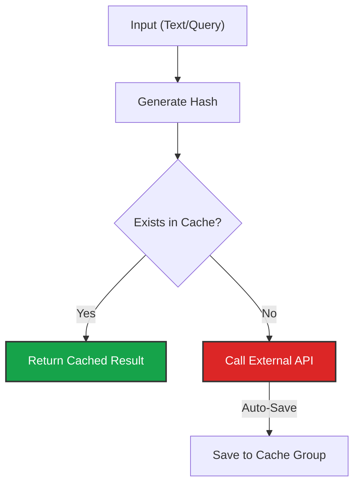

import { Zap, Database, Music, HardDrive, AlertTriangle, Layers, ArrowRight } from 'lucide-react';
import { Step, Steps } from 'fumadocs-ui/components/steps';

The **Caching** tab is where you fine-tune your agent for production scale. By leveraging **Caching**, you can bypass expensive and slow API calls to third-party providers (like OpenAI or ElevenLabs), resulting in near-instant responses.

## The Caching Engine

Iqra AI currently uses **Exact Match Caching**. The system creates a unique cryptographic hash of the input. If it sees that *exact* input again, it serves the stored result instead of generating it from scratch.

*   *Cache Entry:* Agent needs to say "Welcome to our support line." -> **Audio File A**.
*   *Next Call:* Agent needs to say "Welcome to our support line."
*   *Result:* The text matches exactly. **Audio File A** is played instantly (0 latency).

---

## Cache Strategies

You can assign specific **Cache Groups** to your agent.

### 1. Audio Cache (TTS)
Stores the generated audio files for specific text phrases.
*   **Input:** Agent text response.
*   **Output:** MP3/WAV Audio File.
*   **Benefit:** **Critical for Latency.** Skips the 500ms+ generation time from ElevenLabs/Azure.
*   **Best Use:** Standard greetings, disclaimers, and common questions.

### 2. Embedding Cache
Stores the vector representations of text.
*   **Input:** User text chunk.
*   **Output:** Vector Array.
*   **Benefit:** Saves embedding model costs for [Knowledge Base](/build/knowledge) lookups. If a user asks the exact same question twice, we don't need to re-calculate the vectors.

### 3. Message Cache (LLM)
Stores the actual text response generated by the LLM.
*   **Input:** User query.
*   **Output:** Agent text response.
*   **Benefit:** Saves LLM token costs.
*   **Risk:** **Context Blindness.** Since this looks for an exact match of the user's query, it ignores conversation history.
    *   *Input:* "What is your name?" -> Safe to cache.
    *   *Input:* "Why?" -> **Unsafe to cache** (Depends on previous turn).

<Callout type="warn" title="Best Practice">
  Only use Message Caching for **Static FAQs** (e.g., "What are your hours?"). Avoid using it for dynamic conversation flows.
</Callout>

---

## Auto-Caching (Learning Mode)

You can enable **Auto-Cache** for Audio and Embeddings.

*   **Behavior:** Every time the agent generates *new* audio or vectorizes a *new* query, it saves the result to the assigned group.
*   **Result:** Your agent gets faster and cheaper the more it is used, building a library of common phrases automatically.

### Managing Storage
Caching thousands of audio files consumes [Storage](/platform/billing).
*   **Expiry Strategy:** You can set TTL (Time To Live) policies to automatically delete audio files that haven't been accessed in X days, keeping your cache quota efficient.

---

## Future Vision: Semantic & Contextual

We are actively developing the next generation of our caching engine.

<Cards>
  <Card icon={<Layers />} title="Semantic Matching">
    **Coming Soon.** Using vectors to match "Hi" with "Hello". This increases the "Hit Rate" of the cache significantly but requires careful threshold tuning.
  </Card>
  <Card icon={<Zap />} title="Context Awareness">
    **Coming Soon.** The cache lookup will check the *previous turn/chunk* as well as the current one. This ensures that the emotion/tone of the cached audio matches the current flow of the conversation.
  </Card>
</Cards>