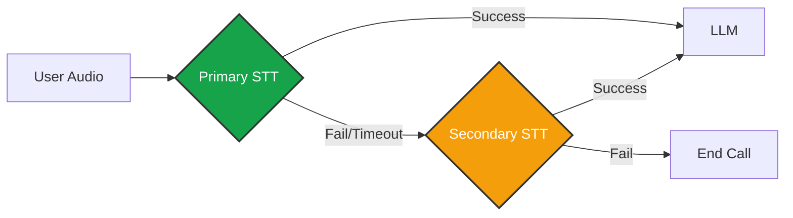

import { BrainCircuit, Mic, Speaker, Layers, Search, Sparkles, Bot, Tag } from 'lucide-react';
import { Step, Steps } from 'fumadocs-ui/components/steps';

The **Intelligence** tab is the control center for your agent's cognitive functions. Here you wire up the "Brain" (LLM), "Ears" (STT), and "Mouth" (TTS), and define exactly how the agent accesses its memory (RAG).

## Integration Configuration

Iqra AI is model-agnostic. For each language enabled in your Business, you must assign specific providers. This allows you to mix-and-match (e.g., Deepgram for English STT, Azure for Arabic STT).

### The Fallback System
We enforce reliability through redundancy. If your primary provider (e.g., OpenAI) goes down or times out, the system automatically fails over to the next provider in the list.

---

## Knowledge Base (RAG)

Connecting a [Knowledge Base](/build/knowledge/rag) is only step one. Step two is defining **Search Triggers**—the logic that decides *when* to look up information.

We offer two distinct architectural approaches: **Pre-Processing** (System-driven) and **Runtime** (Agent-driven).

### Strategy A: Pre-Processing (Faster)
The system performs the search *before* the Agent LLM receives the user's message. The retrieved context is injected into the prompt immediately.

<Cards>
  <Card icon={<Layers />} title="Always Search">
    **Brute Force.** Performs a vector search for *every single user query*.
    *   *Pros:* Maximum context.
    *   *Cons:* High latency and embedding costs.
  </Card>
  
  <Card icon={<Tag />} title="KB Keywords Match">
    **Auto-Tagging.** Searches only if the user mentions keywords extracted automatically from your uploaded documents.
    *   *Pros:* Zero configuration.
    *   *Cons:* Can miss semantic intent.
  </Card>

  <Card icon={<Search />} title="Custom Keywords">
    **Deterministic.** Searches only if the user says specific words you define (e.g., "Refund", "Policy").
    *   *Pros:* Precise control.
    *   *Cons:* High maintenance.
  </Card>
  
  <Card icon={<BrainCircuit />} title="Smart Classifier">
    **Intelligent.** Uses a small, fast LLM to analyze intent. "Does this query require external data?" -> If Yes, Search.
    *   *Pros:* Best balance of speed and accuracy.
    *   *Cons:* Slight latency overhead (~200ms).
  </Card>
</Cards>

### Strategy B: Runtime (Better UX)
The Agent LLM receives the message first, then *decides* to use a tool to search.

<Card icon={<Bot />} title="Script / Tool Only" href="/build/script">
  **Agent-Driven.** The Agent has a "Retrieve Knowledge" tool.
  *   *Flow:* User asks question > Agent says "Let me check that..." > Agent calls Tool > System searches > Agent answers.
  *   *Pros:* **Best User Experience** (No dead air silence).
  *   *Cons:* Can increase the context window of the base prompt
</Card>

### AI Query Refinement
Users rarely speak in perfect search queries.
*   *User says:* "How much is it?"
*   *Vector Search sees:* "How much is it?" (Ambiguous > Poor Results).

If you enable **AI Query Refinement**, an LLM rewrites the query based on conversation history before searching:
*   *Refined Query:* "What is the pricing for the Dental Cleaning service mentioned previously?" (Specific > High Accuracy).

<Callout type="warn" title="Latency Impact">
  Query Refinement significantly improves retrieval accuracy but adds ~300-500ms to the response time. Use only when necessary.
</Callout>