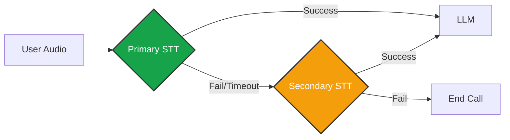

import { BrainCircuit, Mic, Speaker, Layers, Search, Sparkles, Bot } from 'lucide-react';
import { Step, Steps } from 'fumadocs-ui/components/steps';

The **Intelligence** tab is where you define the cognitive and sensory capabilities of your agent. You configure **Three Core Components** for every language your agent speaks:

1.  **STT (Speech-to-Text):** The Ears.
2.  **LLM (Large Language Model):** The Brain.
3.  **TTS (Text-to-Speech):** The Mouth.

## Integration Configuration

For each enabled language in your Business, you must assign specific providers. This allows you to optimize costs and quality per region (e.g., using **Deepgram** for English transcription but **Azure** for Arabic).

### The Fallback System
Iqra AI allows you to define a **Chain of Redundancy**. If your primary provider fails or times out, the system automatically switches to the next one in the list.

### Configuration Steps
1.  **Select Provider:** Choose from your connected Integrations.
2.  **Configure Model:** Select the specific model (e.g., `gpt-4o` vs `gpt-3.5-turbo`) and temperature.
3.  **Voice Settings (TTS):** Select the specific voice ID, stability, and speed.

---

## Knowledge Base (RAG)

Connect your agent to your proprietary data. You can link multiple **Knowledge Base Groups** to a single agent.

### Search Triggers
This determines *when* the agent looks up information. Using RAG on every turn increases latency and cost, so Iqra AI offers granular control.

<Cards>
  <Card icon={<Layers />} title="Always Search">
    **Brute Force.** Performs a vector search for *every single user query*. High context, high latency.
  </Card>
  <Card icon={<Search />} title="Keyword Match">
    **Deterministic.** Only searches if the user says specific words (e.g., "Price", "Refund", "Policy"). You define these keywords per language.
  </Card>
  <Card icon={<BrainCircuit />} title="Smart Classifier (LLM)" href="#smart-classifier">
    **Intelligent.** Uses a fast LLM to analyze the user's intent. If the intent requires external data, it triggers a search.
  </Card>
  <Card icon={<Bot />} title="Script Only" href="/build/script">
    **Manual.** The agent never searches automatically. You must explicitly use the **Retrieve Knowledge** node in the Script Builder.
  </Card>
</Cards>

### AI Query Refinement
Users rarely speak in perfect search queries.
*   *User says:* "How much is it?"
*   *Vector Search sees:* "How much is it?" (Low accuracy).

If you enable **AI Query Refinement**, an LLM rewrites the query before searching:
*   *Refined Query:* "What is the pricing for the Dental Cleaning service?" (High accuracy).

<Callout type="info" title="Trade-off">
  Query Refinement significantly improves retrieval accuracy but adds ~300ms to the response time.
</Callout>