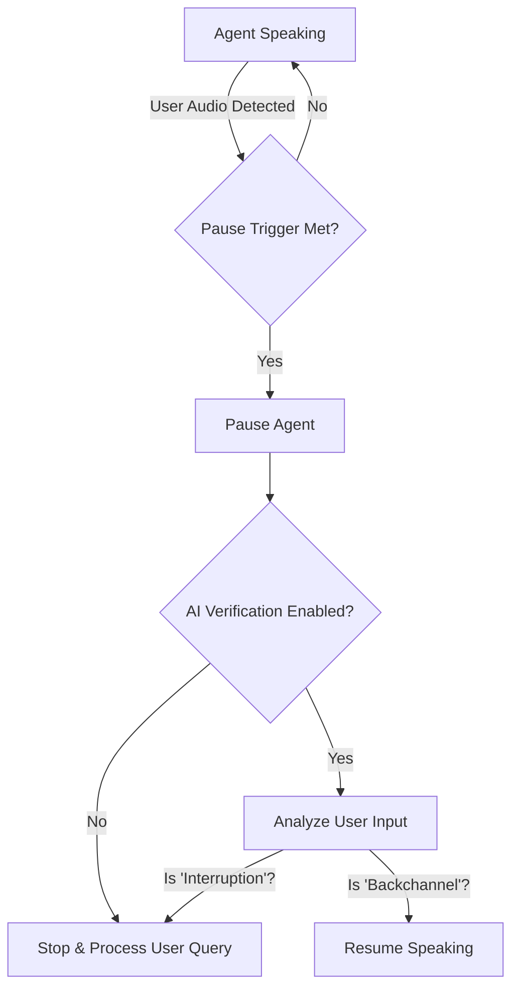

import { Mic, Cpu, BrainCircuit, Activity, ShieldCheck } from 'lucide-react';
import { Step, Steps } from 'fumadocs-ui/components/steps';

The **Interruption Engine** dictates the rhythm of the conversation. It determines two critical behaviors:
1.  **Turn End:** How the agent knows the user has *finished* speaking.
2.  **Interruption:** How the agent behaves when the user *starts* speaking while the agent is talking.

## 1. Turn-End Detection
**"Are you done talking?"**

Iqra AI offers four distinct strategies to detect when the user has finished their turn and is waiting for a response.

<Cards>
  <Card icon={<Activity />} title="VAD (Voice Activity)" href="#vad-classic">
    **Fastest.** Detects silence. If the user stops making sound for X milliseconds, the turn ends.
  </Card>
  <Card icon={<Mic />} title="Transcription" href="#transcription">
    **Balanced.** Uses the STT provider to check for a "Final" segment marker, indicating a complete sentence.
  </Card>
  <Card icon={<BrainCircuit />} title="LLM Decision" href="#llm-decision">
    **Smartest (Context).** Sends the transcript to an LLM to decide if the user's sentence implies they are done.
  </Card>
  <Card icon={<Cpu />} title="ML (Smart Turn)" href="#ml-smart-turn">
    **The Gold Standard.** Uses a specialized Machine Learning model (Pipcat) to analyze the audio stream in real-time.
  </Card>
</Cards>

### Which one should I use?

| Strategy | Pros | Cons | Best For |
| :--- | :--- | :--- | :--- |
| **VAD** | Extremely low latency (&lt;200ms). | Can cut users off if they pause to think. | Simple commands, IVR. |
| **Transcription** | More natural than VAD. | Dependent on STT provider speed. | General conversation. |
| **LLM** | Understands context (e.g., differentiates a pause from a completed list). | High latency/cost. | Complex consultations. |
| **ML (Smart Turn)** | High accuracy, low latency. | Requires slightly higher compute. | **Production Agents.** |

## 2. Interruption Handling (Barge-In)
**"Did you just interrupt me?"**

When the agent is speaking, and the user makes a sound, the agent must decide whether to stop or ignore it.

### Pause Triggers
How much "noise" triggers the agent to pause?

*   **Pause via VAD:** Triggered by continuous sound duration (e.g., 500ms of audio).
*   **Pause via Word Count:** Triggered by transcribed words (e.g., 2 words spoken).

### AI Verification (False Positive Protection)
This is a powerful feature unique to Iqra AI. It prevents the agent from stopping due to background noise (a door slamming) or backchanneling (the user saying "Uh-huh" or "Yes" to show they are listening).

**How it works:**
1.  User makes a sound -> Agent **Pauses**.
2.  The audio is transcribed and sent to a fast LLM.
3.  **The Check:** The LLM compares the user's input against the Agent's current speech.
    *   *Scenario A:* User said "Wait, stop." -> **Agent Stops** and handles the new query.
    *   *Scenario B:* User said "Mhmm" (Listening) -> **Agent Resumes** speaking exactly where it left off.

<Callout type="idea" title="Context Recovery">
  If the interruption was valid, you can enable **"Include Interrupted Speech in Next Turn"**. This ensures that whatever the agent *didn't* get to say is fed back into the LLM context, so the logic isn't lost.
</Callout>

---

## 3. Disable Interruptions
**Turn-by-Turn Mode**

For specific use cases (like taking a dictation, a formal interview, or legacy radio-style comms), you might want to disable interruptions entirely.

*   **Behavior:** The agent will ignore all user audio until it has finished playing its TTS audio file.
*   **Use Case:** Highly disciplined workflows or environments with extreme background noise.

## Visualizing the Flow

