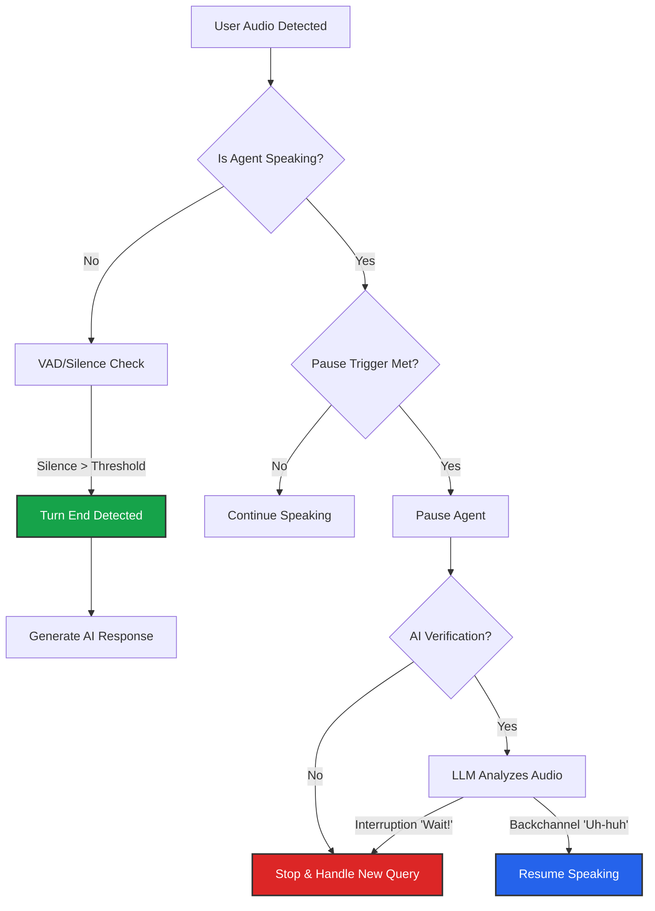

import { Mic, Cpu, BrainCircuit, Activity, ShieldCheck, AlertTriangle } from 'lucide-react';
import { Step, Steps } from 'fumadocs-ui/components/steps';

The **Interruption Engine** is the referee of the conversation. It manages the delicate balance between "Listening" and "Speaking."

## Visualizing the Logic

Before configuring parameters, it helps to understand how the agent makes decisions in real-time when it hears a sound.

---

## 1. Turn-End Detection
**"Are you done talking?"**

How does the agent know the user has finished their sentence and is waiting for a response?

<Cards>
  <Card icon={<Activity />} title="VAD (Voice Activity)">
    **Fastest.** Detects silence. If the user stops making sound for X milliseconds (e.g., 500ms), the turn ends.
  </Card>
  <Card icon={<Mic />} title="Transcription">
    **Balanced.** Uses the STT provider to check for a grammatically complete sentence (Final Segment).
  </Card>
  <Card icon={<BrainCircuit />} title="LLM Decision">
    **Context Aware.** Sends the transcript to an LLM. It understands that a user saying *"I want..."* is not done, even if they pause for 2 seconds.
  </Card>
  <Card icon={<Cpu />} title="ML (Smart Turn)">
    **Experimental / High Fidelity.** Uses a specialized ML model to predict turn-end based on tone and prosody.
  </Card>
</Cards>

### Deep Dive: ML Smart Turn (Pipecat)
This strategy uses the open-source **[Smart Turn](https://github.com/pipecat-ai/smart-turn)** model by Pipecat AI. It analyzes the raw audio stream to detect when a user has finished speaking based on intonation, not just silence.

<Callout type="warn" title="Current Limitations">
  While this is the "Gold Standard" for natural conversation, it is currently **Experimental**.
  *   **Numbers & Emails:** It may struggle to detect turn-end correctly when a user is reciting long number sequences or spelling emails.
  *   **Language Support:** Check the [GitHub Repo](https://github.com/pipecat-ai/smart-turn) for the latest supported languages.
  *   **Recommendation:** Use standard VAD for IVR/Data Collection bots. Use Smart Turn for conversational/support bots.
</Callout>

---

## 2. Interruption Handling (Barge-In)
**"Did you just interrupt me?"**

When the agent is speaking, and the user makes a sound, the agent must decide whether to stop or ignore it.

### Pause Triggers
How much "noise" triggers the agent to pause?

*   **Pause via VAD:** Triggered by continuous sound duration (e.g., user speaks for 400ms). Best for low latency.
*   **Pause via Word Count:** Triggered only after X words are transcribed. Prevents pausing for coughs or door slams.

### AI Verification (False Positive Protection)
This feature prevents the agent from stopping due to "Backchanneling" (the user saying "Uh-huh", "Yes", or "Right" to show they are listening).

**How it works:**
1.  User speaks > Agent **Pauses**.
2.  The audio is transcribed and sent to a fast LLM.
3.  **The Check:** The LLM compares the user's input against the Agent's current speech.
    *   *Input:* "Wait, stop." > **Agent Stops** and handles the new query.
    *   *Input:* "I see..." > **Agent Resumes** speaking exactly where it left off.

<Callout type="idea" title="Context Recovery">
  If the interruption was valid (Agent Stops), you can enable **"Include Interrupted Speech in Next Turn"**. This ensures that whatever the agent *didn't* get to say is fed back into the LLM context, so the logic isn't lost.
</Callout>

---

## 3. Turn-by-Turn Mode
**Disable Interruptions**

For specific use cases (like taking a dictation, a formal interview, or legacy radio-style comms), you might want to disable interruptions entirely.

*   **Behavior:** The agent will ignore all user audio until it has finished playing its current TTS response.
*   **Use Case:** Highly disciplined workflows or environments with extreme background noise (Construction sites, Busy streets).

---
## Future Vision: Dynamic Context Adaptation

Currently, Interruption and Turn-End settings are **Static**—they apply globally to the Agent for the entire duration of the call.

However, we understand that conversation flow changes based on context.
*   **Scenario A (Yes/No):** *"Do you want to proceed?"* > Requires short silence threshold (e.g., 400ms) for a snappy feel.
*   **Scenario B (Data Entry):** *"Please spell your email address."* > Requires long silence threshold (e.g., 1500ms) because users pause while spelling.

We are actively developing **Context-Aware Turn Taking**. This will allow the Agent (or specific Script Nodes) to programmatically adjust the VAD sensitivity, silence duration, and interruption strategy mid-call based on the specific question being asked.