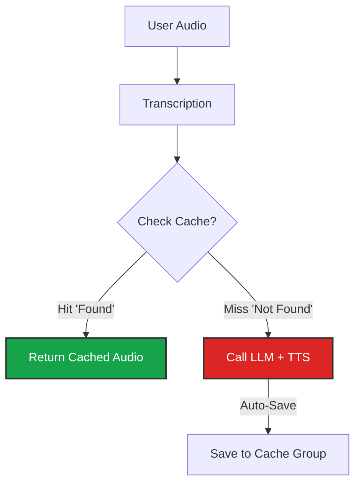

import { Zap, DollarSign, Music, Database, HardDrive, Repeat } from 'lucide-react';

The **Optimization** tab is where you fine-tune your agent for production scale. By leveraging **Caching**, you can bypass expensive and slow API calls to third-party providers (like OpenAI or ElevenLabs), resulting in near-instant responses.

## The Caching Engine

Iqra AI uses **Semantic Caching**. Unlike traditional exact-match caching, our system understands the *meaning* of a sentence.

*   *User says:* "Hello, how are you?"
*   *User says:* "Hi there, how you doing?"

To a computer, these are different strings. To Iqra AI's semantic cache, they are the same intent. If the agent has already generated a response and audio for the first one, it can instantly reuse it for the second one.

### Cache Flow

## Cache Configuration

You can assign specific **Cache Groups** to your agent.

<Cards>
  <Card icon={<Database />} title="Message Cache (LLM)" href="/build/knowledge/cache">
    Skips the LLM generation. If the user asks a common question (e.g., "What are your hours?"), the agent returns the pre-approved text response immediately.
  </Card>
  <Card icon={<Music />} title="Audio Cache (TTS)" href="/build/knowledge/cache">
    **Critical for Latency.** Skips the TTS generation. If the agent needs to say "Welcome to Medina Dental," it plays the pre-generated MP3 file instead of streaming it from ElevenLabs.
  </Card>
  <Card icon={<HardDrive />} title="Embedding Cache" href="/build/knowledge/cache">
    Skips the Vectorization step. Saves costs on embedding models for RAG lookups.
  </Card>
</Cards>

### Auto-Caching (Learning Mode)
You can enable **Auto-Cache** for Audio and Embeddings.
*   **Behavior:** Every time the agent generates *new* audio or vectorizes a *new* query, it saves the result to the assigned group.
*   **Result:** Your agent gets faster and cheaper the more it is used.

<Callout type="warn" title="Storage Costs">
  While caching saves compute costs (LLM/TTS), storing thousands of audio files does consume **Storage**. Monitor your usage in the Billing tab.
</Callout>

## Environment (Background Audio)

To make calls feel more natural and less "robotic," you can inject a continuous background audio loop.

*   **Use Cases:**
    *   **Call Center:** Subtle typing and murmuring sounds.
    *   **Office:** HVAC hum and distant phone rings.
    *   **Cafe:** Clinking cups (for casual agents).
*   **Configuration:** Upload an MP3/WAV file. The platform handles the loop mixing automatically.

<Callout type="tip" title="Psychological Effect">
  Adding a low-volume background track significantly reduces the "Uncanny Valley" effect and makes users more forgiving of small latencies.
</Callout>