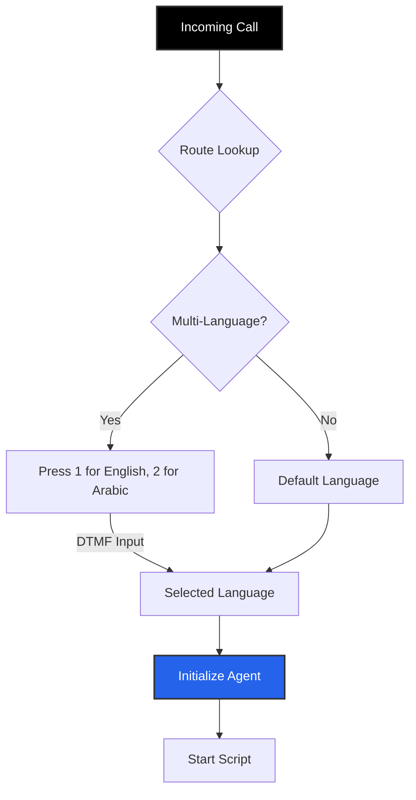

import { PhoneIncoming, Globe, Webhook, Clock, ArrowRightLeft } from 'lucide-react';
import { Step, Steps } from 'fumadocs-ui/components/steps';

**Inbound Routes** define the logic for calls made *by* customers *to* your business phone numbers. They act as the dispatcher, deciding which Agent should pick up, what language should be spoken, and what data should be synced to your CRM.

## The Inbound Flow

## Creating a Route

Navigate to **Business Dashboard** -> **Inbound Routing** -> **Add Route**.

<Steps>
<Step>
### Language & IVR
Iqra AI features a built-in **Programmatic IVR** for language selection.

*   **Single Language:** If you only select one language (e.g., English), the agent picks up immediately in English.
*   **Multi-Language:** If you select multiple (e.g., English & Arabic), the system automatically plays a pre-recorded message: *"Press 1 for English. Press 2 for Arabic."*
    *   **Timeout:** If the user does not press a key within the timeout window, it falls back to the **Default Language**.
</Step>

<Step>
### Link Numbers
Select which of your purchased/connected **Phone Numbers** will use this route.
*   *Note:* A single phone number can only be assigned to *one* active route at a time.
</Step>

<Step>
### Agent Assignment
Select the **Agent** and the **Opening Script**.
*   **Timezone:** Set the operating timezone for the agent (useful for time-based logic in scripts).
*   **Context:** Enable **"Inject Caller Number"** if you want the LLM to know the phone number of the person calling (useful for verification logic).
</Step>

<Step>
### Configuration
Fine-tune the call behavior.
*   **Pickup Delay:** How many seconds to ring before the AI answers.
*   **Max Duration:** Hard limit for call length (safety mechanism to prevent billing runaways).
*   **Silence:** Configure notifications or auto-end logic if the caller goes silent.
</Step>
</Steps>

---

## Actions (Webhooks)

Actions allow you to trigger **Custom Tools** when specific call events occur. This is essential for syncing data with your CRM, Slack, or Database.

<Callout type="info" title="How to use">
  1. Create a [Custom Tool](/build/tools) first (e.g., "Update CRM").
  2. Select that tool in the Action dropdown.
  3. Map the **Available Variables** (below) to the Tool's **Input Schema**.
</Callout>

### 1. Ringing Action
Triggered when the phone network indicates the call is ringing (before pickup).
*   **Use Case:** Logging an attempt in a CRM.

| Variable | Description |
| :--- | :--- |
| `caller_number` | The phone number of the person calling. |
| `called_number` | The business number being dialed. |
| `queue_id` | The unique ID of the routing queue. |
| `timestamp` | Start time of the attempt. |

### 2. Call Picked Action
Triggered the moment the Agent connects to the call.
*   **Use Case:** Updating agent status or starting a session log.

| Variable | Description |
| :--- | :--- |
| `session_id` | Unique UUID for the conversation session. |
| `caller_number` | The phone number of the person calling. |
| `agent_id` | The ID of the agent handling the call. |
| `language` | The language selected (e.g., `en`, `ar`). |

### 3. Call Ended Action
Triggered when the call disconnects (by either side). This is the richest data payload.
*   **Use Case:** Saving transcripts, summaries, or post-call analysis to a database.

| Variable | Description |
| :--- | :--- |
| `session_id` | Unique UUID for the conversation session. |
| `duration` | Total length of the call in seconds. |
| `termination_reason` | Why it ended (e.g., `agent_hangup`, `user_hangup`, `error`). |
| `transcript` | Full text transcript of the conversation. |
| `recording_url` | Link to the MP3 audio file of the call. |
| `cost` | Total calculated cost of the call. |
| `summary` | (If Post-Analysis enabled) The AI-generated summary. |
| `tags` | (If Post-Analysis enabled) List of tags applied (e.g., `["sales", "positive"]`). |
| `extracted_data` | (If Post-Analysis enabled) JSON object of extracted fields. |

### 4. Post-Analysis
Select which **Post-Analysis Template** to run after the call. This runs *before* the Call Ended Action, ensuring the `summary` and `extracted_data` variables are populated and ready to send to your webhook.