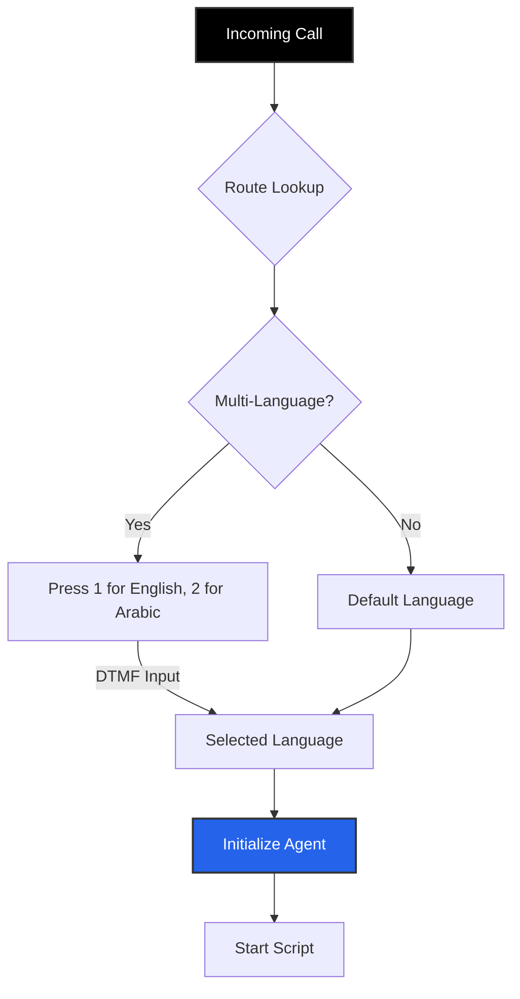

import { PhoneIncoming, Globe, Webhook, Clock, ArrowRightLeft, FileJson, BarChart3 } from 'lucide-react';
import { Step, Steps } from 'fumadocs-ui/components/steps';

**Inbound Routes** define the logic for calls made *by* customers *to* your business phone numbers. They act as the dispatcher, deciding which Agent should pick up, what language should be spoken, and what data should be synced to your CRM.

## The Inbound Flow

## Creating a Route

Navigate to **Business Dashboard** -> **Inbound Routing** -> **Add Route**.

<Steps>
<Step>
### Language & IVR
Iqra AI features a built-in **Programmatic IVR** for language selection.

*   **Single Language:** If you only select one language (e.g., English), the agent picks up immediately.
*   **Multi-Language:** If you select multiple (e.g., English & Arabic), the system automatically plays a pre-recorded message: *"Press 1 for English. Press 2 for Arabic."*
</Step>

<Step>
### Link Numbers
Select which of your connected **Phone Numbers** will use this route.

<Callout type="info" title="Prerequisite: Phone Numbers">
  Before creating a Inbound Route, you must have a phone number available in your workspace.
  
  Manage your numbers in **[Phone Numbers Tab](/build/tools/phone-numbers)**.
</Callout>
</Step>

<Step>
### Agent Assignment
Select the [**Agent**](/build/agent) and the [**Opening Script**](/build/script).
*   **Context:** Enable **"Inject Caller Number"** if you want the LLM to know the phone number of the person calling.
</Step>

<Step>
### Configuration
Fine-tune the call behavior (Pickup Delay, Max Duration, Silence Detection).
</Step>
</Steps>

---

## Post-Analysis

Before the call ends, you can configure how the system analyzes the conversation. This data is available in the **Call Ended** webhook.

1.  Navigate to the **Post Analysis** tab in your Route settings.
2.  Select a **Template** defined in the [Post Analysis Module](/build/operations/analysis).
3.  **Context Variables:** The LLM will receive the following data to generate the summary/tags:

| Variable | Type | Description |
| :--- | :--- | :--- |
| `call_queue_id` | String | Unique ID for this specific call attempt. |
| `call_queue_created_at` | Datetime | When the call entered the platform. |
| `call_queue_enqueued_at` | Datetime | When the call was placed in the processing queue. |
| `call_queue_processing_started_at` | Datetime | When the system started handling the logic. |
| `call_queue_completed_at` | Datetime | When the queue item finished (if applicable). |
| `call_queue_status` | String | Current status (e.g., `ringing`). |
| `call_queue_route_id` | String | The ID of this Inbound Route. |
| `call_queue_calling_number_id` | String | The database ID of the business number being dialed. |
| `call_queue_calling_number_provider` | String | The carrier (e.g., `Twilio`, `Telnyx`). |
| `call_queue_provider_call_id` | String | The Carrier's unique Call SID (Use for debugging with Twilio support). |
| `call_queue_caller_number` | String | The phone number of the person calling. |
| `conversation_id` | String | Unique UUID for the conversation. |
| `conversation_start_time` | Datetime | When the conversation began. |
| `conversation_end_time` | Datetime | When the conversation finished. |
| `conversation_end_type` | String | Reason for termination (e.g., `completed`, `failed`). |
| `conversation_turns` | Object | Raw JSON array of speaker turns. |
| `conversation_turns_simplified` | String | Readable transcript of the chat. |

---

## Actions (Webhooks)

Actions allow you to trigger **[Custom Tools](/build/tools/custom-tools)** when specific call events occur.

<Callout type="info" title="Configuration">
  1. Create a Custom Tool first (e.g., "Update CRM").
  2. Select that tool in the Action dropdown.
  3. Map the **Available Variables** (below) to the Tool's Input Schema.
</Callout>

### 1. Ringing Action
Triggered when the phone network indicates the call is ringing (before pickup).

| Variable | Type | Description |
| :--- | :--- | :--- |
| `call_queue_id` | String | Unique ID for this specific call attempt. |
| `call_queue_created_at` | Datetime | When the call entered the platform. |
| `call_queue_enqueued_at` | Datetime | When the call was placed in the processing queue. |
| `call_queue_processing_started_at` | Datetime | When the system started handling the logic. |
| `call_queue_completed_at` | Datetime | When the queue item finished (if applicable). |
| `call_queue_status` | String | Current status (e.g., `ringing`). |
| `call_queue_route_id` | String | The ID of this Inbound Route. |
| `call_queue_calling_number_id` | String | The database ID of the business number being dialed. |
| `call_queue_calling_number_provider` | String | The carrier (e.g., `Twilio`, `Telnyx`). |
| `call_queue_provider_call_id` | String | The Carrier's unique Call SID (Use for debugging with Twilio support). |
| `call_queue_caller_number` | String | The phone number of the person calling. |

### 2. Call Picked Action
Triggered the moment the Agent connects to the call.

| Variable | Type | Description |
| :--- | :--- | :--- |
| `call_queue_id` | String | Unique ID for the call attempt. |
| `call_queue_created_at` | Datetime | When the call started ringing. |
| `call_queue_enqueued_at` | Datetime | When queued. |
| `call_queue_processing_started_at` | Datetime | When processing began. |
| `call_queue_status` | String | Status (e.g., `processing`). |
| `call_queue_campaign_id` | String | The Route ID. |
| `call_queue_calling_number_id` | String | Business number ID. |
| `call_queue_calling_number_provider` | String | Carrier Name. |
| `call_queue_provider_call_id` | String | Carrier Call SID. |
| `call_queue_caller_number` | String | Customer phone number. |
| `conversation_id` | String | Unique UUID for the active conversation session. |

### 3. Call Ended Action
Triggered when the call disconnects. This contains the richest data payload.

| Variable | Type | Description |
| :--- | :--- | :--- |
| `call_queue_id` | String | Unique ID for the call attempt. |
| `call_queue_created_at` | Datetime | When the call started ringing. |
| `call_queue_enqueued_at` | Datetime | When queued. |
| `call_queue_processing_started_at` | Datetime | When processing began. |
| `call_queue_completed_at` | Datetime | When the call fully finalized. |
| `call_queue_status` | String | Final status (e.g., `completed`). |
| `call_queue_campaign_id` | String | The Route ID. |
| `call_queue_calling_number_id` | String | Business number ID. |
| `call_queue_calling_number_provider` | String | Carrier Name. |
| `call_queue_provider_call_id` | String | Carrier Call SID. |
| `call_queue_caller_number` | String | Customer phone number. |
| `conversation_id` | String | Unique UUID for the conversation. |
| `conversation_start_time` | Datetime | Exact start time of audio. |
| `conversation_end_time` | Datetime | Exact end time of audio. |
| `conversation_end_type` | String | `agent_hangup`, `user_hangup`, `timeout`, or `error`. |
| `conversation_turns` | Object | Full structured JSON array of every turn. |
| `conversation_turns_simplified` | String | Human-readable transcript string. |