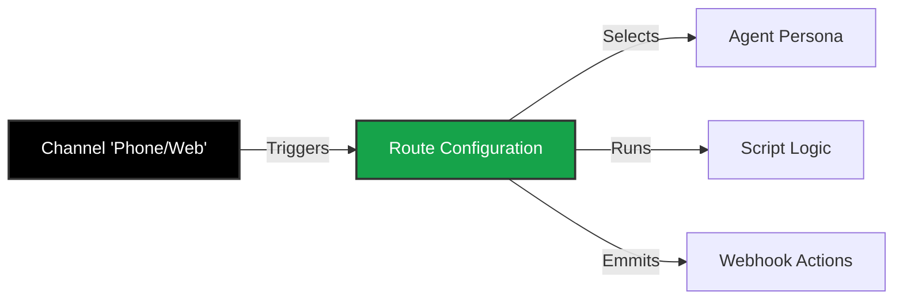

import { Route, PhoneIncoming, PhoneOutgoing, Globe, Webhook, Settings } from 'lucide-react';

An **Agent** and a **Script** are just code sitting on a server. To make them useful, you need to connect them to a communication channel.

**Routing** is the "Bridge" layer of Iqra AI. It defines the rules for how a conversation starts, which Agent handles it, and what happens when it ends.

## The Connection Logic

## Campaign Types

Iqra AI supports three distinct types of conversation flows.

<Cards>
  <Card icon={<PhoneIncoming />} title="Inbound Routing" href="/build/campaigns/inbound">
    **Reactive.** Handle calls coming *into* your business phone numbers.
    *   **Features:** Multi-language IVR ("Press 1 for English"), Queue management, Fallback routing.
  </Card>
  <Card icon={<PhoneOutgoing />} title="Outbound Campaigns" href="/build/campaigns/outbound">
    **Proactive.** Trigger calls *out* to your customers (Single or Bulk CSV).
    *   **Features:** Retry logic (Busy/No Answer), Voicemail Detection (AMD), Local presence dialing.
  </Card>
  <Card icon={<Globe />} title="Web Campaigns" href="/build/campaigns/web">
    **Digital.** Real-time voice sessions inside a browser or mobile app via WebRTC.
    *   **Features:** Low latency, secure socket connections, frontend widget integration.
  </Card>
</Cards>

## Shared Components

Regardless of the campaign type, you will need to manage the underlying infrastructure.

<Cards>
  <Card icon={<Settings />} title="Phone Numbers" href="/build/campaigns/numbers">
    Connect your **BYOC (Bring Your Own Carrier)** accounts like Twilio, Telnyx, or SIP Trunks. Configure region-specific routing for latency optimization.
  </Card>
  <Card icon={<Webhook />} title="Actions & Webhooks" href="/build/campaigns/inbound#actions">
    Trigger external APIs when specific events happen (e.g., Call Initiated, Call Ended, Call Failed).
  </Card>
</Cards>