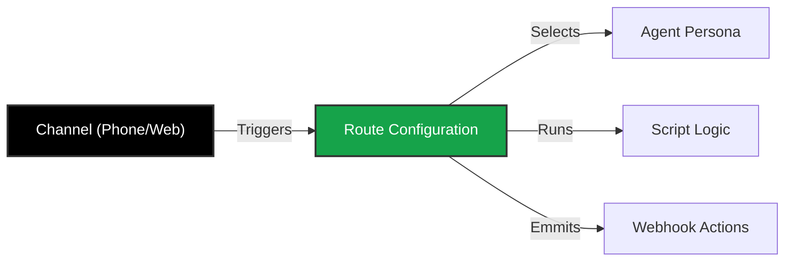

import { Route, PhoneIncoming, PhoneOutgoing, Globe, MessageCircle, Video, Smartphone } from 'lucide-react';

An **Agent** and a **Script** are just code sitting on a server. To make them useful, you need to connect them to a communication channel.

**Routing** is the "Bridge" layer of Iqra AI. It defines the rules for how a conversation starts, which Agent handles it, and what happens when it ends.

## The Connection Logic

## Campaign Types

Iqra AI supports three distinct types of conversation flows today.

<Cards>
  <Card icon={<PhoneIncoming />} title="Inbound Routing" href="/build/campaigns/inbound">
    **Reactive.** Handle calls coming *into* your business phone numbers.
    *   **Features:** Multi-language IVR ("Press 1 for English"), Queue management, Fallback routing.
  </Card>
  <Card icon={<PhoneOutgoing />} title="Outbound Campaigns" href="/build/campaigns/outbound">
    **Proactive.** Trigger calls *out* to your customers (Single or Bulk CSV).
    *   **Features:** Retry logic (Busy/No Answer), Voicemail Detection (AMD), Local presence dialing.
  </Card>
  <Card icon={<Globe />} title="Web Campaigns" href="/build/campaigns/web">
    **Digital.** Real-time voice sessions inside a browser or mobile app via WebRTC.
    *   **Features:** Low latency, secure socket connections, frontend widget integration.
  </Card>
</Cards>

## Future Roadmap: Omni-Channel

We are actively working to bring your agents to every platform your customers use.

<Cards>
  <Card icon={<MessageCircle />} title="WhatsApp Audio">
    **Coming Soon.** Native routing for WhatsApp Voice Calls, allowing you to bypass traditional PSTN costs entirely.
  </Card>
  <Card icon={<Video />} title="Meeting Bots">
    **Coming Soon.** Agents that can join **Google Meet**, **Microsoft Teams**, or **Zoom** calls to participate or take notes.
  </Card>
  <Card icon={<Smartphone />} title="App Integrations">
    **Coming Soon.** Direct integrations for **Telegram Voice** and **Messenger**.
  </Card>
</Cards>