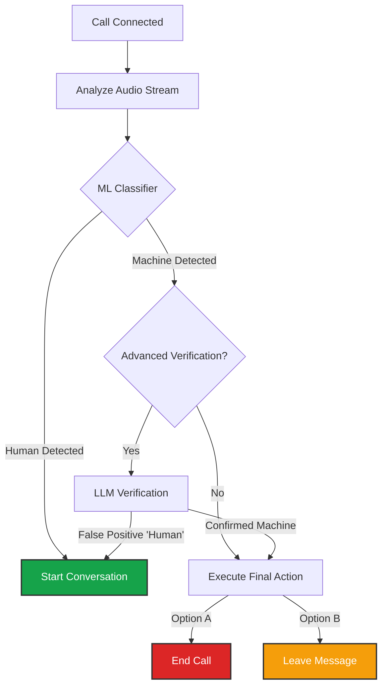

import { PhoneOutgoing, Voicemail, RefreshCcw, Database, Webhook, BarChart3, ListFilter } from 'lucide-react';
import { Step, Steps } from 'fumadocs-ui/components/steps';

**Outbound Campaigns** act as the "Configuration Template" for making calls. Whether you are launching a single call via API or a bulk blast via CSV, you must select a Campaign to define *how* the call behaves.

## Campaign Configuration

Navigate to **Business Dashboard** -> **Telephony Campaigns** -> **Add Campaign**.

<Steps>
<Step>
### Agent & Script
Select the [**Agent**](/build/agent) and the [**Opening Script**](/build/script).
*   **Context:** Enable **"Inject To/From Numbers"** if your script logic depends on knowing who is being called.
</Step>

<Step>
### Number Routing (Local Presence)
Instead of picking a single caller ID, you define a **Strategy**.

*   **Default Number:** The fallback number used for most calls.
*   **Regional Overrides:** You can define rules: *"If the destination number starts with `+968` (Oman), use my Omani phone number."*
    *   *Benefit:* Significantly increases answer rates by showing a familiar local code to the recipient or lower local calling charges.
</Step>

<Step>
### Retry Logic
Define persistence for failed attempts.
*   **Triggers:** Select whether to retry on **Busy Signals**, **Decline**, or **No Answer**.
*   **Limits:** Max retries (e.g., 3 attempts) and the delay between them (e.g., 1 hour).
</Step>
</Steps>

## Voicemail Detection (AMD)

Iqra AI features an enterprise-grade **Answering Machine Detection (AMD)** engine. This ensures your agent doesn't start talking to a beep.

### The Detection Pipeline

### Configuration
1.  **Initial Check Delay:** How long to listen before making a decision (usually 2-3 seconds).
2.  **Advanced Verification (LLM):** If enabled, sends the greeting audio to an LLM to confirm it is a voicemail. Reduces false positives.
3.  **Triggers:**
    *   **Stop Speaking:** Pauses the agent immediately if a machine is detected.
    *   **Final Action:** Choose to **End Call** immediately or **Leave Message** (uses a specific path in your script).

---

## Variables & Metadata

To make calls dynamic (e.g., "Hello **Ahmed**"), you must define the expected variables here.

*   **Variables:** Data used inside the Script logic (e.g., `customer_name`).
*   **Metadata:** Data attached to the call session but not used in the script (e.g., `crm_id`).

**Requirement:** If you mark a variable as **Required**, the API or CSV upload *must* provide it, otherwise the call will fail to launch.

---

## Post-Analysis

Configure how the system analyzes the conversation after it ends.

1.  Navigate to the **Post Analysis** tab.
2.  Select a **Template** defined in the [Post Analysis Module](/build/operations/analysis).
3.  **Context Variables:** The LLM will receive the following data to generate the summary/tags:

| Variable | Type | Description |
| :--- | :--- | :--- |
| `call_queue_id` | String | Unique ID for this specific call attempt. |
| `call_queue_created_at` | Datetime | When the call entered the platform. |
| `call_queue_enqueued_at` | Datetime | When the call was placed in the processing queue. |
| `call_queue_processing_started_at` | Datetime | When the system started handling the logic. |
| `call_queue_completed_at` | Datetime | When the queue item finished (if applicable). |
| `call_queue_status` | String | Current status (e.g., `ringing`). |
| `call_queue_route_id` | String | The ID of this Inbound Route. |
| `call_queue_calling_number_id` | String | The database ID of the business number being dialed. |
| `call_queue_calling_number_provider` | String | The carrier (e.g., `Twilio`, `Telnyx`). |
| `call_queue_provider_call_id` | String | The Carrier's unique Call SID (Use for debugging with Twilio support). |
| `call_queue_recipient_number` | String | The number being called. |
| `conversation_id` | String | Unique UUID for the conversation. |
| `conversation_start_time` | Datetime | When the conversation began. |
| `conversation_end_time` | Datetime | When the conversation finished. |
| `conversation_end_type` | String | Reason for termination (e.g., `completed`, `failed`). |
| `conversation_turns` | Object | Raw JSON array of speaker turns. |
| `conversation_turns_simplified` | String | Readable transcript of the chat. |

---

## Actions (Webhooks)

Outbound campaigns have specific lifecycle events that you can sync to your external systems.

<Callout type="info" title="Configuration">
  1. Create a [Custom Tool](/build/tools/custom-tools) first.
  2. Select that tool in the Action dropdown.
  3. Map the **Available Variables** (below) to the Tool's Input Schema.
</Callout>

### 1. Call Initiation Failure
Triggered when the systen fails to initalize a conversation.

| Variable | Type | Description |
| :--- | :--- | :--- |
| `call_queue_id` | String | Unique ID for this specific call attempt. |
| `call_queue_created_at` | Datetime | When the API request was received. |
| `call_queue_enqueued_at` | Datetime | When it was placed in the dispatch queue. |
| `call_queue_processing_started_at` | Datetime | When the dialer started processing. |
| `call_queue_completed_at` | Datetime | When the queue item finished (if applicable). |
| `call_queue_status` | String | Current status (e.g., `initiated`). |
| `call_queue_campaign_id` | String | The Campaign ID. |
| `call_queue_calling_number_id` | String | ID of the From Number used. |
| `call_queue_calling_number_provider` | String | Provider of the From Number (e.g. Twilio). |
| `call_queue_provider_call_id` | String | The Carrier's Call SID (if available). |
| `call_queue_recipient_number` | String | The number being called. |
| `call_queue_scheduled_for_date_time` | Datetime | When the call was scheduled for. |
| `call_queue_dynamic_variables` | Object | JSON object of variables passed to the script. |
| `call_queue_metadata` | Object | JSON object of metadata attached to the call. |
| `call_queue_initiation_error` | String | Error details (e.g. `provider_error`, `busy`). |

### 2. Call Initiated
Triggered when the system starts dialing.

| Variable | Type | Description |
| :--- | :--- | :--- |
| `call_queue_id` | String | Unique ID for this specific call attempt. |
| `call_queue_created_at` | Datetime | When the API request was received. |
| `call_queue_enqueued_at` | Datetime | When it was placed in the dispatch queue. |
| `call_queue_processing_started_at` | Datetime | When the dialer started processing. |
| `call_queue_completed_at` | Datetime | When the queue item finished (if applicable). |
| `call_queue_status` | String | Current status (e.g., `initiated`). |
| `call_queue_campaign_id` | String | The Campaign ID. |
| `call_queue_calling_number_id` | String | ID of the From Number used. |
| `call_queue_calling_number_provider` | String | Provider of the From Number (e.g. Twilio). |
| `call_queue_provider_call_id` | String | The Carrier's Call SID (if available). |
| `call_queue_recipient_number` | String | The number being called. |
| `call_queue_scheduled_for_date_time` | Datetime | When the call was scheduled for. |
| `call_queue_dynamic_variables` | Object | JSON object of variables passed to the script. |
| `call_queue_metadata` | Object | JSON object of metadata attached to the call. |
| `conversation_id` | String | (Nullable) ID of the conversation if created. |

### 3. Call Declined
Triggered if the call is rejected.

| Variable | Type | Description |
| :--- | :--- | :--- |
| `call_queue_id` | String | Unique ID for this specific call attempt. |
| `call_queue_created_at` | Datetime | When the API request was received. |
| `call_queue_enqueued_at` | Datetime | When it was placed in the dispatch queue. |
| `call_queue_processing_started_at` | Datetime | When the dialer started processing. |
| `call_queue_completed_at` | Datetime | When the attempt failed. |
| `call_queue_status` | String | Status (e.g., `failed`, `declined`, `missed`). |
| `call_queue_campaign_id` | String | The Campaign ID. |
| `call_queue_calling_number_id` | String | ID of the From Number used. |
| `call_queue_calling_number_provider` | String | Provider of the From Number. |
| `call_queue_provider_call_id` | String | The Carrier's Call SID. |
| `call_queue_recipient_number` | String | The number called. |
| `call_queue_scheduled_for_date_time` | Datetime | When the call was scheduled for. |
| `call_queue_dynamic_variables` | Object | JSON object of variables passed to the script. |
| `call_queue_metadata` | Object | JSON object of metadata attached to the call. |
| `conversation_id` | String | (Nullable) ID of the conversation if partial connect occurred. |

### 3. Call Missed
Triggered if the call does not connect, or times out.

| Variable | Type | Description |
| :--- | :--- | :--- |
| `call_queue_id` | String | Unique ID for this specific call attempt. |
| `call_queue_created_at` | Datetime | When the API request was received. |
| `call_queue_enqueued_at` | Datetime | When it was placed in the dispatch queue. |
| `call_queue_processing_started_at` | Datetime | When the dialer started processing. |
| `call_queue_completed_at` | Datetime | When the attempt failed. |
| `call_queue_status` | String | Status (e.g., `failed`, `declined`, `missed`). |
| `call_queue_campaign_id` | String | The Campaign ID. |
| `call_queue_calling_number_id` | String | ID of the From Number used. |
| `call_queue_calling_number_provider` | String | Provider of the From Number. |
| `call_queue_provider_call_id` | String | The Carrier's Call SID. |
| `call_queue_recipient_number` | String | The number called. |
| `call_queue_scheduled_for_date_time` | Datetime | When the call was scheduled for. |
| `call_queue_dynamic_variables` | Object | JSON object of variables passed to the script. |
| `call_queue_metadata` | Object | JSON object of metadata attached to the call. |
| `conversation_id` | String | (Nullable) ID of the conversation if partial connect occurred. |

### 4. Call Answered
Triggered when the call is picked up (by human or machine) and audio starts flowing.

| Variable | Type | Description |
| :--- | :--- | :--- |
| `call_queue_id` | String | Unique ID for this specific call attempt. |
| `call_queue_created_at` | Datetime | When the API request was received. |
| `call_queue_enqueued_at` | Datetime | When it was placed in the dispatch queue. |
| `call_queue_processing_started_at` | Datetime | When the dialer started processing. |
| `call_queue_completed_at` | Datetime | When the answer event occurred. |
| `call_queue_status` | String | Status (e.g., `answered`). |
| `call_queue_campaign_id` | String | The Campaign ID. |
| `call_queue_calling_number_id` | String | ID of the From Number used. |
| `call_queue_calling_number_provider` | String | Provider of the From Number. |
| `call_queue_provider_call_id` | String | The Carrier's Call SID. |
| `call_queue_recipient_number` | String | The number called. |
| `call_queue_scheduled_for_date_time` | Datetime | When the call was scheduled for. |
| `call_queue_dynamic_variables` | Object | JSON object of variables passed to the script. |
| `call_queue_metadata` | Object | JSON object of metadata attached to the call. |
| `conversation_id` | String | Unique UUID for the active conversation session. |
| `conversation_start_time` | Datetime | Exact timestamp when conversation began. |

### 5. Call Ended
Triggered when the conversation finishes.

| Variable | Type | Description |
| :--- | :--- | :--- |
| `call_queue_id` | String | Unique ID for this specific call attempt. |
| `call_queue_created_at` | Datetime | When the API request was received. |
| `call_queue_enqueued_at` | Datetime | When it was placed in the dispatch queue. |
| `call_queue_processing_started_at` | Datetime | When the dialer started processing. |
| `call_queue_completed_at` | Datetime | When the call fully finalized. |
| `call_queue_status` | String | Final status (e.g., `completed`). |
| `call_queue_campaign_id` | String | The Campaign ID. |
| `call_queue_calling_number_id` | String | ID of the From Number used. |
| `call_queue_calling_number_provider` | String | Provider of the From Number. |
| `call_queue_provider_call_id` | String | The Carrier's Call SID. |
| `call_queue_recipient_number` | String | The number called. |
| `call_queue_scheduled_for_date_time` | Datetime | When the call was scheduled for. |
| `call_queue_dynamic_variables` | Object | JSON object of variables passed to the script. |
| `call_queue_metadata` | Object | JSON object of metadata attached to the call. |
| `conversation_id` | String | Unique UUID for the conversation. |
| `conversation_start_time` | Datetime | Start time of audio. |
| `conversation_end_time` | Datetime | End time of audio. |
| `conversation_end_type` | String | `agent_hangup`, `user_hangup`, `voicemail_ended`, `timeout`. |
| `conversation_turns` | Object | Raw JSON array of every speaker turn. |
| `conversation_turns_simplified` | String | Human-readable transcript string. |