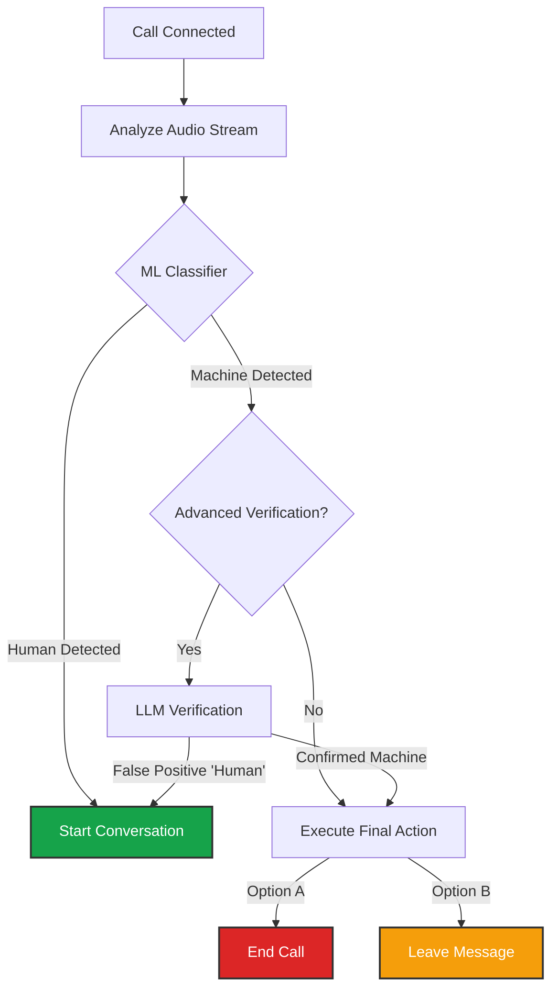

import { PhoneOutgoing, Voicemail, RefreshCcw, Database, Webhook } from 'lucide-react';
import { Step, Steps } from 'fumadocs-ui/components/steps';

**Outbound Campaigns** act as the "Configuration Template" for making calls. Whether you are launching a single call via API or a bulk blast via CSV, you must select a Campaign to define *how* the call behaves.

## Campaign Configuration

Navigate to **Business Dashboard** -> **Telephony Campaigns** -> **Add Campaign**.

<Steps>
<Step>
### Agent & Script
Select the Persona and Logic for the call.
*   **Context:** Enable **"Inject To/From Numbers"** if your script logic depends on knowing who is being called (e.g., looking up a user in a CRM by phone number).
</Step>

<Step>
### Number Routing (Local Presence)
Instead of picking a single caller ID, you define a **Strategy**.

*   **Default Number:** The fallback number used for most calls.
*   **Regional Overrides:** You can define rules: *"If the destination number starts with `+968` (Oman), use my Omani phone number."*
    *   *Benefit:* Significantly increases answer rates by showing a familiar local code to the recipient.
</Step>

<Step>
### Retry Logic
Define persistence for failed attempts.
*   **Triggers:** Select whether to retry on **Busy Signals**, **Decline**, or **No Answer**.
*   **Limits:** Max retries (e.g., 3 attempts) and the delay between them (e.g., 1 hour).
</Step>
</Steps>

## Voicemail Detection (AMD)

Iqra AI features an enterprise-grade **Answering Machine Detection (AMD)** engine. This ensures your agent doesn't start talking to a beep, or conversely, knows exactly how to leave a message.

### The Detection Pipeline

### Configuration
1.  **Initial Check Delay:** How long to listen before making a decision (usually 2-3 seconds).
2.  **Advanced Verification (LLM):** If enabled, sends the greeting audio to an LLM to confirm it is a voicemail (e.g., "Hi, you've reached John...") vs a human greeting. This reduces false positives but adds cost.
3.  **Triggers:**
    *   **Stop Speaking:** Pauses the agent immediately if a machine is detected (prevents talking over the greeting).
    *   **Final Action:** Choose to **End Call** immediately or **Leave Message** (uses a specific path in your script).

---

## Variables & Metadata

To make calls dynamic (e.g., "Hello **Ahmed**, your bill is **$50**"), you must define the expected variables here.

*   **Variables:** Data used inside the Script logic (e.g., `customer_name`, `appointment_time`).
*   **Metadata:** Data attached to the call session but not used in the script (e.g., `crm_id`).

**Requirement:** If you mark a variable as **Required**, the API or CSV upload *must* provide it, otherwise the call will fail to launch.

---

## Actions (Webhooks)

Outbound campaigns have specific lifecycle events that you can sync to your external systems.

<Callout type="info" title="Context">
  These variables are available to map to your [Custom Tool](/build/tools) Input Schema when an action is triggered.
</Callout>

### 1. Call Initiated
Triggered when the system starts dialing.
*   **Variables:** `campaign_id`, `recipient_phone`, `from_phone`, `timestamp`.

### 2. Call Failed / Declined / Missed
Triggered if the call does not connect.
*   **Use Case:** Scheduling a retry in your own CRM or marking a lead as "Unreachable".
*   **Variables:** `failure_reason` (e.g., busy, congestion), `retry_count`.

### 3. Call Answered
Triggered when the call is picked up (by human or machine).
*   **Variables:** `session_id`, `pickup_time`.

### 4. Call Ended
Triggered when the conversation finishes.
*   **Use Case:** Saving the outcome.

| Variable | Description |
| :--- | :--- |
| `session_id` | Unique UUID. |
| `duration` | Length of call. |
| `termination_reason` | `agent_hangup`, `user_hangup`, or `voicemail_ended`. |
| `voicemail_detected` | Boolean (`true`/`false`). |
| `transcript` | Full text. |
| `recording_url` | MP3 link. |
| `cost` | Total cost. |
| `summary` | (If Post-Analysis enabled). |
| `tags` | (If Post-Analysis enabled). |
| `extracted_data` | (If Post-Analysis enabled) JSON data. |