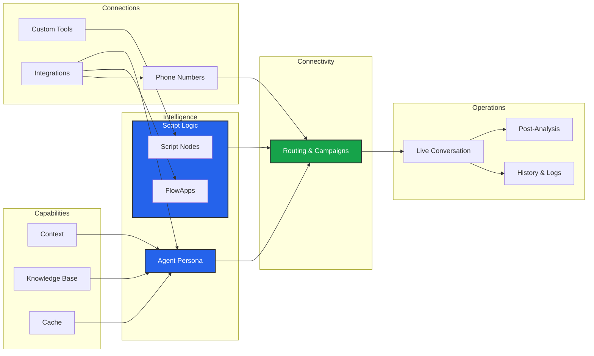

import { Bot, GitFork, Phone, Database, Hammer, BarChart3, Play, History, Network, Blocks } from 'lucide-react';

The **Business Dashboard** is your engineering workshop. While the User Dashboard handles billing and tenancy, this is where you build the actual AI architecture.

Everything you create here—Agents, Scripts, Numbers—is strictly isolated to this specific **Workspace**.

## The Builder Architecture

Building a "Superhuman Employee" involves assembling four distinct layers:

## Workspace Modules

We have organized the sidebar into logical groups to streamline your workflow.

### 1. Intelligence & Logic
Define *who* speaks and *how* they think.

<Cards>
  <Card icon={<Bot />} title="Agent Studio" href="/build/agent">
    **The Persona.** Configure the Voice, Personality, Interruption logic, and Language capabilities.
  </Card>
  <Card icon={<GitFork />} title="Script Builder" href="/build/script">
    **The Brain.** Use the Visual Editor to design conversation flows, implement **Action Flows**, and manage state via **Variables**.
  </Card>
</Cards>

### 2. Capabilities & Memory
Give your agent tools to interact with the world and data to answer questions.

<Cards>
  <Card icon={<Blocks />} title="Tools & Integrations" href="/build/tools">
    **Hands.** Connect **FlowApps** (Plugins like Cal.com) or build custom HTTP tools to perform actions.
  </Card>
  <Card icon={<Database />} title="Knowledge, Cache & Context" href="/build/knowledge">
    **Memory.** Manage **RAG** (Documents), **Context** (Business Hours/Locations), and **Semantic Caching**.
  </Card>
</Cards>

### 3. Connectivity
Connect your logic to the outside world.

<Cards>
  <Card icon={<Network />} title="Routing & Campaigns" href="/build/campaigns">
    **The Bridge.** Configure Inbound Routes, Outbound Campaigns, and Web/Socket Channels.
  </Card>
  <Card icon={<Phone />} title="Phone Numbers" href="/build/campaigns/numbers">
    **Infrastructure.** Manage BYOC (Twilio/Telnyx/SIP) numbers and assign them to specific **Latency Regions**.
  </Card>
</Cards>

### 4. Operations
Execute campaigns and analyze results.

<Cards>
  <Card icon={<Play />} title="Make Calls" href="/build/operations/manual-calls">
    **Launchpad.** Trigger outbound calls immediately. Supports **Single Call** testing and **Bulk CSV** uploads for mass outreach.
  </Card>
  <Card icon={<History />} title="History & Logs" href="/build/operations/history">
    **Observability.** Review recordings, read transcripts, and inspect deep-level debug traces for every conversation.
  </Card>
  <Card icon={<BarChart3 />} title="Post Analysis" href="/build/operations/analysis">
    **Intelligence.** Define schemas to extract structured JSON data, generate summaries, and tag conversations automatically.
  </Card>
</Cards>