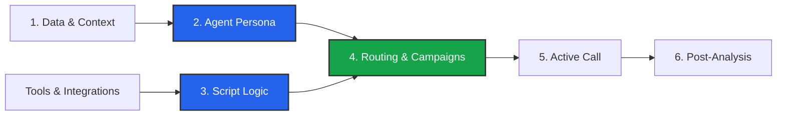

import { Bot, GitFork, Phone, Database, Hammer, BarChart3, Play } from 'lucide-react';

The **Business Dashboard** is where the magic happens. Unlike the User Dashboard (which manages billing and tenancy), this is your **Builder Workspace**. Every agent, script, and phone call belongs to a specific Business.

## The Builder Workflow

Building a Voice AI agent isn't linear, but it generally follows this architecture:

## Core Modules

The dashboard is divided into logical sections to help you manage the complexity of Voice AI.

### 1. The Brains (Agent & Script)
This is where you define *who* is speaking and *what* they do.

<Cards>
  <Card icon={<Bot />} title="Agent Studio" href="/build/agent">
    Define the personality, voice, interruption logic, and language settings.
  </Card>
  <Card icon={<GitFork />} title="Script Builder" href="/build/script">
    Build the conversation flow using a visual graph. Handle user queries, logic branches, and tool execution.
  </Card>
</Cards>

### 2. The Body (Routing)
This is how your agent connects to the outside world (Telephony/Web).

<Cards>
  <Card icon={<Phone />} title="Campaigns & Routing" href="/build/campaigns">
    **Inbound:** IVR logic and number assignment.
    **Outbound:** Campaign configuration and voicemail detection.
  </Card>
</Cards>

### 3. The Knowledge (Data)
Give your agent context about your business.

<Cards>
  <Card icon={<Database />} title="Knowledge & Context" href="/build/knowledge">
    **RAG:** Upload documents for the agent to search.
    **Context:** Define static data like Branches, Services, and Branding.
  </Card>
  <Card icon={<Hammer />} title="Tools" href="/build/tools">
    Create custom HTTP tools (APIs) for the agent to interact with your backend.
  </Card>
</Cards>

### 4. The Results (Operations)
Monitor performance and extract data.

<Cards>
  <Card icon={<BarChart3 />} title="Post Analysis" href="/build/operations/analysis">
    Define schemas to extract structured JSON data and tags from every conversation.
  </Card>
  <Card icon={<Play />} title="Manual Actions" href="/build/operations/manual-calls">
    Launch instant single calls or bulk CSV campaigns directly from the dashboard.
  </Card>
</Cards>

## Quick Actions

At the top of the dashboard, you will find the **Make Calls** button. This is your testing ground.
*   **Single Call:** Perfect for testing your new agent on your own phone number immediately.
*   **Bulk Call:** Upload a CSV to trigger a blast campaign.