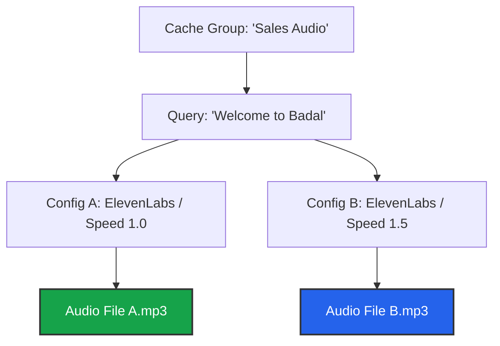

import { Database, Network, Sliders, Layers, Play, AlertTriangle, FileAudio, Zap } from 'lucide-react';
import { Step, Steps } from 'fumadocs-ui/components/steps';

The **Cache Manager** allows you to inspect and manage the shared memory banks of your agents.

Unlike simple key-value stores, Iqra AI's cache is **Configuration Aware**. This means a single Cache Group can hold multiple variations of the same phrase (e.g., different speeds or embedding models) without collision.

## The Cache Hierarchy

Understanding the data structure is key to debugging cache hits/misses.

*   **The Group:** The high-level bucket (e.g., "English Audio").
*   **The Query:** The text to be spoken or embedded.
*   **The Configuration:** The specific settings used (Provider, Voice ID, Speed, Temperature).
*   **The Data:** The actual generated file or vector.

<Callout type="warn" title="Sensitivity">
  If you change **any** parameter in your Agent's integration (e.g., changing Speed from `1.0` to `1.1`), the system will treat it as a **New Configuration**. It will **not** use the old cache entry; it will generate a new one.
</Callout>

---

## Managing Groups

Navigate to **Business Dashboard** -> **Cache**. You will see three sub-tabs for the different data types.

### 1. Message Cache (Text)
**Stores:** Static LLM Responses.
*   **Structure:** Simple Key-Value pair.
*   **Management:** You can manually add entries here (e.g., Query: "Who are you?", Response: "I am Iqra.").
*   **Usage:** Best for FAQs where the answer never changes.

### 2. Audio Cache (TTS)
**Stores:** Generated Audio data/files.
*   **Management:** You can view the list of queries. Clicking a query reveals the specific **Configurations** stored for it.
*   **Preview:** <Play className="w-3 h-3 inline"/> Listen to the generated audio to ensure quality.
*   **Pre-warming:** You can add a Query manually. The next time an Agent (with a specific config) requests this text, it will generate and save the audio.

### 3. Embedding Cache (Vectors)
**Stores:** Mathematical representations of text.
*   **Management:** View cached queries.
*   **Benefit:** Allows multiple agents using the same Embedding Model (e.g., `text-embedding-3`) to share the cost of vectorizing the Knowledge Base queries.

---

## Operations

### Deleting Entries
You can delete cache at three levels:
1.  **Delete Group:** Wipes everything.
2.  **Delete Query:** Removes "Welcome" and all its variations (Speed 1.0, 1.5, etc.).
3.  **Delete Configuration:** Removes only the specific version (e.g., just the "Speed 1.5" version).

### Setting Expiry (TTL)
To manage storage costs, you can define a **Time-To-Live**.
*   **Settings:** Defined at the Group level.
*   **Logic:** If a specific cache entry is not accessed for `X` days, it is automatically purged.

<Callout type="tip" title="Maintenance">
  If you update your Agent's Voice ID, the old cache entries become "Dead Weight" (they will never be hit again). It is good practice to **Delete** the old Configuration entries or rely on TTL to clean them up.
</Callout>

---

## Future Roadmap

We are enhancing the cache engine to be more intelligent.

<Cards>
  <Card icon={<Layers />} title="Semantic Matching">
    **Coming Soon.** Using vectors to match "Hi" with "Hello". This increases the "Hit Rate" of the cache significantly but requires careful threshold tuning.
  </Card>
  <Card icon={<Zap />} title="Context Awareness">
    **Coming Soon.** The cache lookup will check the *previous turn/chunk* as well as the current one. This ensures that the emotion/tone of the cached audio matches the current flow of the conversation.
  </Card>
</Cards>