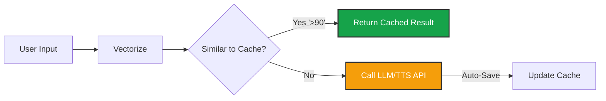

import { Zap, Database, Music, HardDrive, RefreshCw } from 'lucide-react';
import { Step, Steps } from 'fumadocs-ui/components/steps';

In Voice AI, milliseconds matter. Generating text via an LLM and then synthesizing audio via TTS takes time (and money).

Iqra AI uses a **Semantic Cache** system. This allows your agent to "remember" previous interactions. If a user asks a question the agent has answered before, it can pull the pre-calculated response and pre-generated audio instantly, bypassing the external AI providers entirely.

## How Semantic Cache Works

Unlike standard caching (which looks for exact text matches), Semantic Caching uses vector embeddings to understand **Intent**.

*   **Cache Entry:** User asks "What is your pricing?" $\to$ Agent replies "It is $50."
*   **New User:** Asks "How much does it cost?"
*   **Result:** The system recognizes these questions have the same meaning. It serves the cached "It is $50" response instantly.

## Cache Types

You organize data into **Cache Groups**. You can attach these groups to specific Agents.

<Cards>
  <Card icon={<Database />} title="Message Cache">
    Stores **LLM Responses**.
    *   **Input:** User Query.
    *   **Output:** Agent Text Response.
    *   **Benefit:** Saves LLM tokens and generation time.
  </Card>
  <Card icon={<Music />} title="Audio Cache">
    Stores **TTS Files**.
    *   **Input:** Agent Text.
    *   **Output:** MP3/WAV Audio File.
    *   **Benefit:** Massive latency reduction. Saves TTS provider costs (e.g., ElevenLabs characters).
  </Card>
  <Card icon={<HardDrive />} title="Embedding Cache">
    Stores **Vectors**.
    *   **Input:** Text.
    *   **Output:** Vector Array.
    *   **Benefit:** Saves embedding model costs for RAG lookups.
  </Card>
</Cards>

## Configuration

### 1. Create Groups
Navigate to **Business Dashboard** -> **Cache**. Create the specific groups you need (e.g., "Sales Audio Cache").

### 2. Connect to Agent
Navigate to **Agents** -> **[Select Agent]** -> **Cache Tab**.
Select which groups the agent should read from and write to.

### 3. Auto-Caching (Learning Mode)
You can enable **Auto-Cache** in the Agent settings.
*   **Enabled:** Every time the agent generates a *new* response or audio file during a live call, it saves it to the cache group.
*   **Result:** The agent "learns" and becomes faster over time as it builds a library of common responses.

<Callout type="warn" title="Audio Consistency">
  Audio Cache is tied to the **Voice Configuration**. If you change the Agent's Voice ID or Speed, the old cached audio files will be invalid (they will sound different). You should clear or change the Audio Cache Group when changing voices.
</Callout>

## Manual Management

You can manually add entries to the cache to "Pre-warm" the agent.

1.  Open a **Message Cache Group**.
2.  Click **Add Entry**.
3.  **User Query:** "What are your hours?"
4.  **Agent Response:** "We are open 9 to 5."

Now, the very first user who asks this will get an instant response, without the LLM ever needing to think about it.