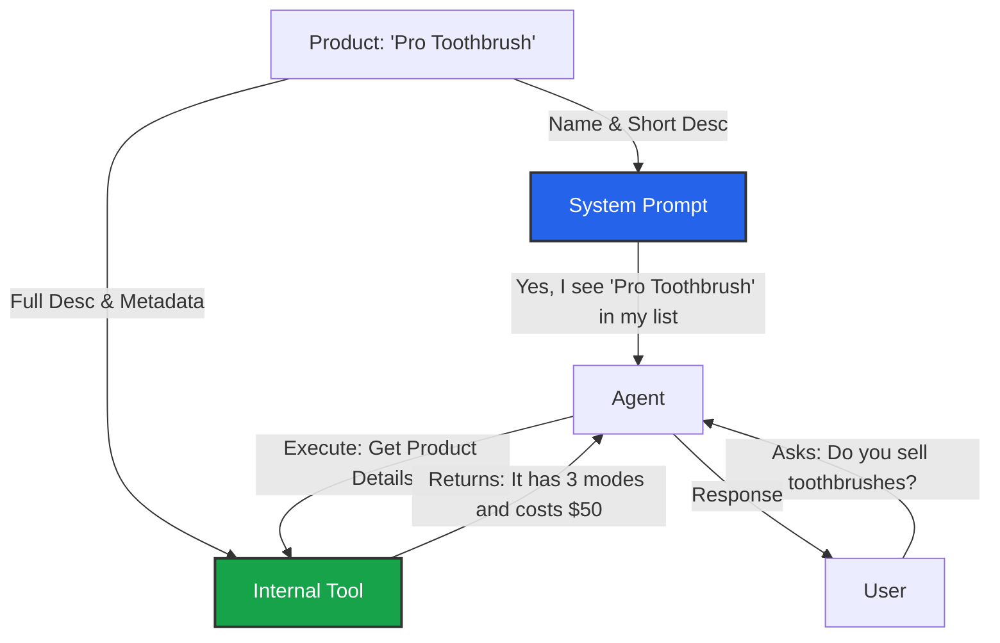

import { Store, ShoppingBag, MapPin, Tag, BrainCircuit } from 'lucide-react';
import { Step, Steps } from 'fumadocs-ui/components/steps';

**Context** refers to the structured facts about your business. Unlike the Knowledge Base (which is for documents), Context is for specific entities that have defined properties like "Name", "Price", or "Opening Hours".

## The Injection Strategy
**How to handle large catalogs without breaking the context window.**

If you have 50 products, putting every full description into the Agent's System Prompt would be expensive and confuse the LLM. Iqra AI uses a **Summary + Tool** strategy.

1.  **Injected:** The Agent *always* knows the **Name** and **Short Description** of your entities.
2.  **Retrievable:** The Agent uses an internal tool to fetch **Full Description**, **Pricing**, and **Metadata** only when the user specifically asks.

---

## Context Modules

### 1. Branding
Global variables for the business identity.
*   **Fields:** Business Name, Website, Support Email, Support Phone.
*   **Usage:** Automatically available to the agent to answer questions like "What is your website?".

### 2. Branches
Physical locations of the business.
*   **Fields:** Name, Address, Phone, Email, Google Maps Link.
*   **Working Hours:** Structured opening/closing times per day.
*   **Usage:** "Where is your nearest branch?" or "Are you open right now?"

### 3. Services & Products
The catalog of what the business offers.
*   **Name:** The identifier (e.g., "Dental Cleaning").
*   **Short Description:** One sentence summary (e.g., "Routine plaque removal"). *Injected into Prompt.*
*   **Full Description:** Detailed specs, pricing, or procedures. *Retrieved via Tool.*
*   **Branch Availability:** Link specific services to specific branches.

---

## Managing Context

<Steps>
<Step>
### Add Data
Navigate to **Business Dashboard** -> **Context**. Select the module (e.g., **Products**) and click **Add Product**.
</Step>

<Step>
### Fill Details
Enter the required information. Be concise with the **Short Description** as it consumes tokens in every call. Be verbose with the **Full Description**.
</Step>

<Step>
### Enable in Agent
Data is not automatically added to every agent. You must enable it explicitly.
1.  Go to **Agents**.
2.  Edit your Agent.
3.  Go to the **Context Tab**.
4.  Toggle **Enable Products** (and others).
</Step>
</Steps>

## Advanced: Metadata
For Services and Products, you can add custom **Key/Value** pairs.

*   *Example:* `sku: 12345`, `stock_status: in_stock`.
*   The agent can read these fields when retrieving details, allowing for dynamic answers based on custom attributes.