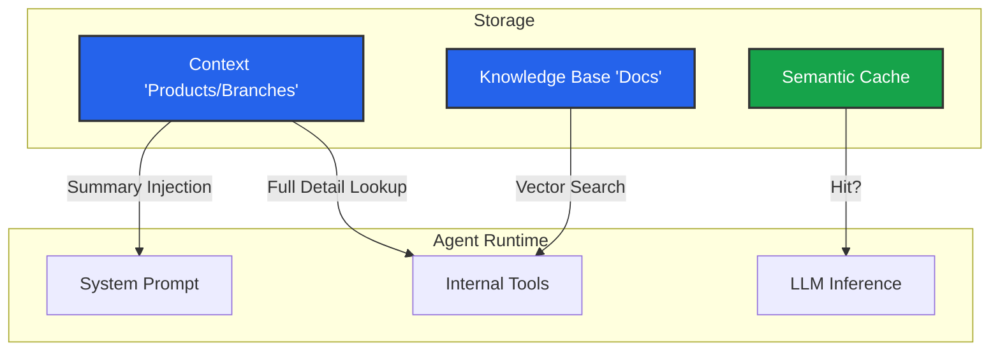

import { Database, FileText, Store, Zap, TableProperties } from 'lucide-react';

An AI Agent is only as good as the information it has access to. In Iqra AI, we separate data into distinct categories to optimize for **Accuracy**, **Latency**, and **Token Usage**.

Instead of dumping everything into a massive system prompt (which is expensive and slow), you structure your data into modules that the agent can "pull" from when needed.

## Data Types

### 1. Business Context (Structured)
This is "Fact-based" data. It is highly structured and usually required for specific logic.
*   **Branding:** Company Name, Website, Email.
*   **Entities:** Lists of [Branches](/build/knowledge/context#branches), [Services](/build/knowledge/context#services), and [Products](/build/knowledge/context#products).

**When to use:** When you have concrete lists (e.g., "What are your 3 locations?"). The agent can inject summaries into the prompt and search for details dynamically.

### 2. Knowledge Base (Unstructured)
This is "Document-based" data using RAG (Retrieval Augmented Generation).
*   **Documents:** PDFs, Word Docs, Text files.
*   **Pipeline:** Upload $\to$ Chunk $\to$ Embed $\to$ Search.

**When to use:** For general information, FAQs, policy documents, or massive datasets (e.g., "What is your refund policy for X?").

### 3. Cache (Performance)
This is "Historical" data used for speed.
*   **Storage:** Saves generated Audio (TTS), Responses (LLM), and Vectors.

**When to use:** To reduce latency and API costs for repetitive queries.

---

## Modules

<Cards>
  <Card icon={<Store />} title="Context Manager" href="/build/knowledge/context">
    Define your Branding, Branches, Services, and Products. Configure what gets injected into the prompt vs. what is retrieved via tools.
  </Card>
  
  <Card icon={<Database />} title="Knowledge Base (RAG)" href="/build/knowledge/rag">
    Configure vector stores. Set up advanced chunking strategies (Parent-Child) and Hybrid Search retrieval settings.
  </Card>
  
  <Card icon={<Zap />} title="Caching" href="/build/knowledge/cache">
    Configure Semantic Caching groups for Audio, Messages, and Embeddings to lower latency.
  </Card>
</Cards>

## Data Flow Architecture

Understanding how data reaches the agent:

