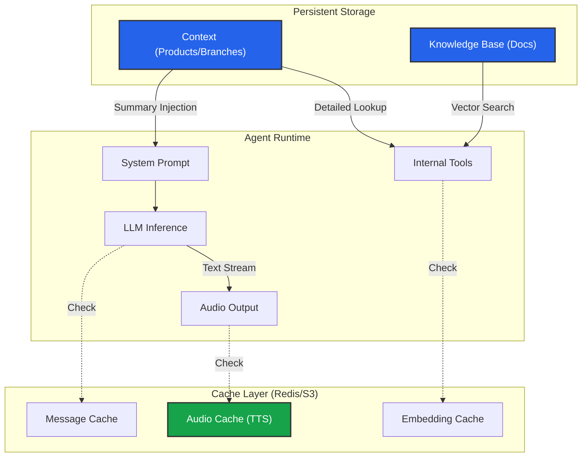

import { Database, FileText, Store, Zap, TableProperties, HardDrive, Music, MessageSquare } from 'lucide-react';

An AI Agent is only as good as the information it has access to. In Iqra AI, we separate data into distinct categories to optimize for **Accuracy**, **Latency**, and **Token Usage**.

<Callout type="info" title="Global vs. Session Data">
  This section covers **Global Data** (Facts about your business that rarely change). 
  
  If you are looking to store data specific to a *single phone call* (like the user's name or booking ID), use **[Script Variables](/build/script/variables)** instead.
</Callout>

## Data Layers

### 1. Business Context (Structured)
**The Hard Facts.** Highly structured entities defined in the dashboard.
*   **Examples:** Branch Locations, Opening Hours, Product Catalog.
*   **Strategy:** "Summary Injection." The agent gets a list of product names in its prompt (low cost), but uses a tool to fetch the full specs only when asked (high detail).

### 2. Knowledge Base (Unstructured)
**The Library.** Documents ingested via a **RAG (Retrieval Augmented Generation)** pipeline.
*   **Examples:** PDF Manuals, Policy Docs, FAQs.
*   **Strategy:** "Vector Search." The system chunks your documents and retrieves only the relevant paragraphs based on the user's query.

### 3. Cache (Performance)
**The Short-Term Memory.** Storing generated outputs to save time and money.
*   **Examples:** TTS Audio files, LLM Responses, Vector Embeddings.
*   **Strategy:** "Exact Match." If the system has seen this input before, it skips the AI generation entirely.

---

## Workspace Modules

<Cards>
  <Card icon={<Store />} title="Context Manager" href="/build/knowledge/context">
    **Structured Data.** Define your Branding, Branches, Services, and Products. Control the injection strategy (Prompt vs. Tool).
  </Card>
  
  <Card icon={<Database />} title="Knowledge Base (RAG)" href="/build/knowledge/rag">
    **Unstructured Data.** Configure vector stores, advanced chunking (Parent-Child), and search triggers.
  </Card>
  
  <Card icon={<Zap />} title="Caching" href="/build/knowledge/cache">
    **Performance.** Manage cache groups to reduce latency and API costs.
  </Card>
</Cards>

## Data Flow Architecture

How data moves from storage to the agent's brain:

