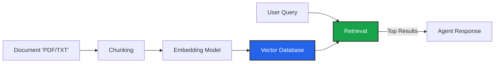

import { Database, FileText, Split, Search, ArrowDownUp, BrainCircuit } from 'lucide-react';
import { Step, Steps } from 'fumadocs-ui/components/steps';

The **Knowledge Base** allows your agent to "read" your proprietary documents. Iqra AI uses a **RAG (Retrieval Augmented Generation)** pipeline to find relevant information from uploaded files and feed it to the agent in real-time.

## The RAG Pipeline

## 1. Creating a Group

Documents are organized into **Groups**. Settings are applied at the Group level.

### Chunking Strategies
How should we split your documents?

<Cards>
  <Card icon={<Split />} title="General Chunking">
    Splits text linearly based on character count.
    *   **Good for:** Simple text files, FAQs.
    *   **Settings:** Max Chunk Length, Overlap.
  </Card>
  <Card icon={<FileText />} title="Parent-Child Chunking">
    **Advanced.** Splits documents into small "Child" chunks for search, but retrieves the larger "Parent" chunk for context.
    *   **Good for:** Complex policy documents, manuals.
    *   **Why:** Searching small text is accurate, but the AI needs the surrounding paragraphs to answer correctly.
  </Card>
</Cards>

### Retrieval Settings
How do we find the right chunk?

*   **Vector Search:** Uses semantic meaning (embeddings). Matches concepts, not just words.
*   **Full Text:** Standard keyword search. Matches exact words.
*   **Hybrid Search (Recommended):** Combines Vector and Full Text scores. Best of both worlds.

#### Reranking
You can enable a **Rerank Model**.
1.  System retrieves top 50 matches.
2.  Reranker analyzes them deeply and sorts them by relevance.
3.  System returns top 5 to the Agent.
*   **Result:** Higher accuracy.
*   **Cost:** Higher latency (~200ms added).

---

## 2. Connecting to Agent

Creating a Knowledge Base does not automatically give the agent access to it. You must link them in the **Agent Studio**.

1.  Go to **Agents** -> **[Select Agent]** -> **Knowledge Base**.
2.  Add the Knowledge Base Group.
3.  **Configure Search Triggers:**

| Trigger | Description | Latency Cost |
| :--- | :--- | :--- |
| **Always Search** | Searches the database for *every* user turn. | High |
| **Keyword Match** | Searches only if user says specific words (e.g., "Policy", "Price"). | Low |
| **Smart Classifier** | Uses a fast LLM to decide "Does this query require external data?". | Medium |
| **Script Only** | Never searches automatically. You must use the **Retrieve Knowledge** node in the [Script Builder](/build/script). | None |

### AI Query Refinement
Sometimes users ask vague questions like *"How much?"*.
If enabled, **Query Refinement** uses an LLM to rewrite this into *"How much does the Premium Plan cost?"* based on conversation history before searching the database. This vastly improves accuracy.

---

## 3. Managing Documents

Inside a Knowledge Base Group, you can manage the actual files.

<Steps>
<Step>
### Upload
Supported formats: PDF, DOCX, TXT, MD.
</Step>

<Step>
### Pre-processing
You can choose to automatically strip URLs, Emails, or excessive whitespace during upload to clean the data.
</Step>

<Step>
### Inspect & Edit
After processing, click on a document to see its **Chunks**.
You can **Manually Edit** the text of a chunk.
*   *Use Case:* The PDF parsing messed up a table. You can go in and fix the text so the AI understands it better.
</Step>
</Steps>