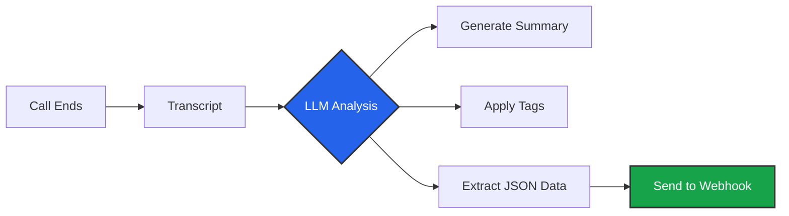

import { FileJson, Tag, FileText, Split, ArrowRight } from 'lucide-react';
import { Step, Steps } from 'fumadocs-ui/components/steps';

Voice conversations are unstructured. A 10-minute call is just a blob of text. **Post Analysis** uses an LLM to process the transcript immediately after the call ends, converting it into structured business data.

## The Analysis Pipeline



## Creating a Template

You define your analysis rules in a **Template**. This allows you to reuse the same extraction logic across multiple campaigns.

Navigate to **Business Dashboard** -> **Post Analysis** -> **Add Template**.

### 1. Summary
The simplest form of analysis.
*   **Prompt:** You can guide the AI.
    *   *Default:* "Summarize the conversation."
    *   *Custom:* "Summarize the user's complaints specifically focusing on technical issues."

### 2. Conversation Tags
Classify calls into buckets for reporting. Iqra AI supports **Hierarchical Tags** (up to 5 levels deep).

*   **Top Level:** e.g., "Sales", "Support".
*   **Child Level:** e.g., "Sales" $\to$ "Interested", "Sales" $\to$ "Not Interested".

**Configuration:**
*   **Description:** Tell the AI *when* to apply this tag. (e.g., "Apply this if the user asks for pricing").
*   **Multi-Select:** Can a call have multiple tags from the same level?

### 3. Data Extraction (JSON)
This is the most powerful feature. You define a **Schema**, and the AI fills it out.

**Supported Data Types:**
*   **String:** Text values (e.g., Names, Feedback).
*   **Number:** Amounts, Quantities.
*   **Boolean:** True/False flags (e.g., `is_urgent`).
*   **Datetime:** Standardized timestamps (e.g., `2023-10-27T10:00:00Z`).
*   **Enum (Options):** Restricts the AI to a specific list (e.g., `[Low, Medium, High]`).

#### Conditional Logic
You can create dynamic extraction rules. Why extract a "Cancellation Reason" if the user didn't cancel?

*   **Logic:** *If* `user_cancelled` (Boolean) is `True`, *Then* extract `cancellation_reason` (String).
*   **Benefit:** Keeps your data clean and reduces hallucinations.

---

## Using the Data

Once you have created a template, you must **Assign it**.

1.  Go to your **Inbound** or **Outbound Campaign**.
2.  Navigate to the **Post Analysis** tab.
3.  Select your Template.

### Viewing Results
*   **Dashboard:** Open the **Conversations Tab** and click on a call details view. You will see the analysis card.
*   **API/Webhook:** The analysis result is sent in the `Call Ended` webhook payload.

```json title="Example Webhook Payload"
{
  "session_id": "...",
  "summary": "User called about login issues. Reset password successfully.",
  "tags": ["Support", "Resolved"],
  "extracted_data": {
    "issue_type": "Login",
    "customer_mood": "Frustrated",
    "ticket_id": 12345
  }
}
```