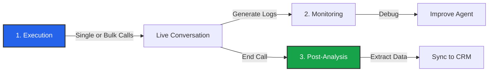

import { Play, BarChart3, History, FileSpreadsheet, Search } from 'lucide-react';

Once your Agent, Script, and Routes are configured, you move into the **Operations** phase. This is the day-to-day management of your Voice AI infrastructure.

## The Operational Cycle

Running a Voice AI business involves three distinct steps:

## Modules

<Cards>
  <Card icon={<Play />} title="Manual Calls" href="/build/operations/manual-calls">
    **Launch.** Trigger instant outbound calls.
    *   **Single Call:** Perfect for testing.
    *   **Bulk (CSV):** Upload thousands of contacts for mass outreach.
  </Card>
  
  <Card icon={<BarChart3 />} title="Post Analysis" href="/build/operations/analysis">
    **Extract.** Turn unstructured audio into structured data.
    *   Define schemas to extract JSON data (e.g., `appointment_date`).
    *   Configure automatic tagging and summarization.
  </Card>
  
  <Card icon={<History />} title="History & Logs" href="/build/operations/history">
    **Audit.** Review every conversation.
    *   Listen to recordings and read transcripts.
    *   View detailed debug logs (Latency traces, Tool executions).
  </Card>
</Cards>

## Data Export

While the dashboard provides powerful views, you often need the data elsewhere. Operations is tightly coupled with **Webhooks**.

*   **Real-time:** Use [Campaign Actions](/build/campaigns/outbound#actions) to sync call statuses as they happen.
*   **Post-Call:** Use the `Call Ended` action to send the structured data generated by **Post Analysis** to your database or CRM.