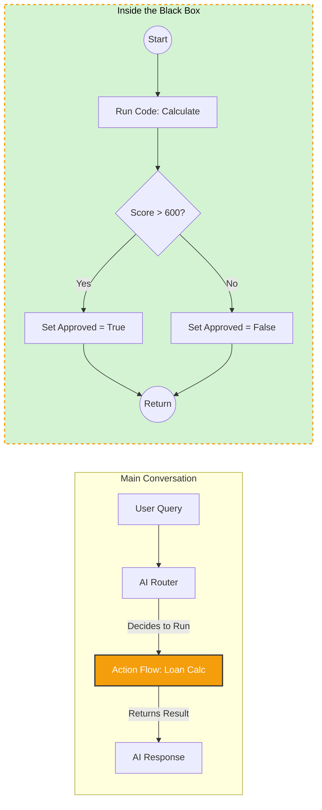

import { GitFork, Calculator, Clock, Code, Filter, Box } from 'lucide-react';
import { Banner } from 'fumadocs-ui/components/banner';

<Callout type="warn" title="Coming Soon!">
The Action Flow engine is currently in active development. This documentation reflects the architectural vision.
</Callout>

**Action Flows** allow you to embed "Mini-Programs" inside your conversation script.

In the main script, the AI acts as a **Router**—it decides where to go next based on user intent. Inside an Action Flow, the system acts as a **Controller**—it executes nodes sequentially and strictly, ignoring user intent until the flow is complete.

## Why use Action Flows?

| Mode | Main Graph | Action Flow |
| :--- | :--- | :--- |
| **Driver** | The AI (Probabilistic) | The System (Deterministic) |
| **Logic** | Conversation Flow | Business Logic |
| **Example** | "The user wants to book, so I will ask for the date." | "If Credit Score < 600, Reject. Else, Calculate Interest." |

## The Container

An Action Flow appears as a single **Group Node** on the main canvas.
*   **Inputs:** You define variables the flow needs (e.g., `loan_amount`).
*   **Outputs:** You define the results (e.g., `is_approved`, `interest_rate`).

To the AI Agent, this entire group looks like a **Single Tool**. It calls the tool, waits, and gets the result.

## Internal Nodes

Inside an Action Flow, you have access to specialized **Logic Nodes** that are not available (or work differently) in the main graph.

<Cards>
  <Card icon={<Filter />} title="Condition (If/Else)">
    **Logic Gates.** Branch the flow based on variable values.
    *   *Example:* `If variables.balance > 0` > Path A. `Else` > Path B.
  </Card>
  
  <Card icon={<Code />} title="Run Code">
    **Sandboxed JS.** Write JavaScript to perform complex math, string manipulation, or data parsing that is too hard for scriban templates.
    *   *Example:* `return Math.pow(input.rate, 2);`
  </Card>
  
  <Card icon={<Clock />} title="Wait / Delay">
    **Pause Execution.** Hold the flow for a set duration.
    *   **Speaking:** You can configure the agent to play "Hold Music" or filler phrases ("Please wait while I calculate...") during the delay.
  </Card>
  
  <Card icon={<GitFork />} title="Go To Action">
    **Loops.** Jump back to a previous step in the flow. Useful for retrying API calls or iterating through lists.
  </Card>
</Cards>

## Execution Behavior

When the AI triggers an Action Flow:
1.  **AI Mutes:** The LLM stops generating text.
2.  **System Takes Over:** The engine executes the nodes inside the group one by one.
3.  **Latency Masking:** If the flow takes time (e.g., heavy API calls), the system plays the defined `SpeakingBeforeExecution` audio.
4.  **Completion:** Once the flow hits a **Return** node, control is handed back to the LLM with the final output variables.