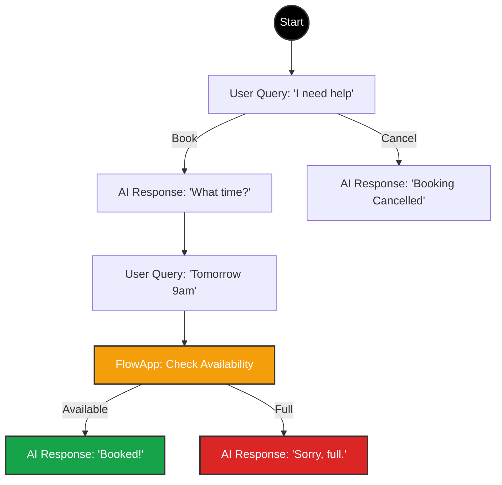

import { LayoutTemplate, MousePointer2, Variable, Blocks, GitFork, Shield, Globe, Braces, Play, Maximize, Undo, Map, CheckCircle2, XCircle, ZoomIn } from 'lucide-react';
import { Step, Steps } from 'fumadocs-ui/components/steps';

The **Script Builder** is more than a flowchart tool; it is a visual programming environment (IDE).

While the **Agent** defines the *personality*, the **Script** defines the *execution*. It acts as a state machine that orchestrates the conversation, manages variables, executes logic, and securely handles data.

## The Interface

The builder is organized to give you maximum canvas space while keeping powerful tools accessible.

### 1. The Sidebar Palette (Left)
This contains your building blocks. Nodes are grouped by function:
*   **Conversation:** User Query, AI Response, SMS.
*   **Action Flow:** Logic groups, Conditions, Waits.
*   **Logic:** Go To Node, Continue From Node, Set Variable.
*   **Telephony:** End Call, Transfer, Keypad Input.
*   **Integrations:** **FlowApps** (Cal.com, HubSpot) and Custom Tools.

### 2. The Floating Controls (Bottom Right)
A dock containing essential view and state tools:
*   **<Map className="w-3 h-3 inline"/> Minimap:** Toggle the eagle-eye view of your graph.
*   **<Maximize className="w-3 h-3 inline"/> Full Screen:** Enter distraction-free mode.
*   **<Undo className="w-3 h-3 inline"/> Undo / Redo:** Revert changes safely.
*   **<ZoomIn className="w-3 h-3 inline"/> Zoom Controls:** Fit to screen or zoom in/out.
*   **<Braces className="w-3 h-3 inline"/> Script Variables:** Open the variable manager to define global state.

---

## Native Multi-Language

Iqra AI does not use cluttered tabs for every text field. Instead, we use a **Global Context Selector**.

### The Language Dropdown
Located in the **Top Header** (or below the Minimap in Full Screen mode), this dropdown controls what you *see* on the canvas.

*   **View Context:** When you select "Arabic", all text fields in all nodes switch to show their Arabic content.
*   **Validation Indicators:**
    *   <CheckCircle2 className="w-4 h-4 text-green-500 inline"/> **Green Check:** All multi-language fields for this language are filled.
    *   <XCircle className="w-4 h-4 text-red-500 inline"/> **Red Cross:** Some nodes are missing content for this language.

<Callout type="tip" title="Workflow">
  Build your logic flow in your primary language first. Then, switch the dropdown to your secondary languages to fill in the missing translations without disrupting the graph structure.
</Callout>

---

## Building Your First Flow

<Steps>
<Step>
### Start Node
Every script begins here. This is the entry point when the call connects.
</Step>

<Step>
### Drag "User Query"
From the **Conversation** category, drag a **User Query** node.
*   *Intent:* "I want to book".
*   Connect the **Start Node** to this node.
</Step>

<Step>
### Drag "AI Response"
Drag an **AI Response** node.
*   *Text:* "Sure! What day works for you?"
*   Connect the **User Query** to this node.
</Step>

<Step>
### Add Branching Logic
You can handle different outcomes. For example, if the user says "Cancel" instead, you can branch to a different path.
</Step>
</Steps>

### Visualization

Here is how a simple booking flow looks with branching logic. The AI follows the path based on the user's intent.

---

## Advanced Capabilities

<Cards>
  <Card icon={<Variable />} title="Script Variables" href="/build/script/variables">
    **Memory.** Define variables (Global/Local) to store data. Toggle **Visibility** to hide secrets from the AI agent.
  </Card>
  
  <Card icon={<Blocks />} title="FlowApps" href="/build/script/flowapps">
    **Plugins.** Use pre-built integrations like Cal.com. Features dynamic dropdowns and "Latency Masking".
  </Card>
  
  <Card icon={<GitFork />} title="Action Flows" href="/build/script/action-flows">
    **Logic Engine.** Group nodes into deterministic sub-routines. Force the AI to follow strict business rules.
  </Card>
  
  <Card icon={<Shield />} title="Secure Sessions" href="/build/script/secure-sessions">
    **Clean Room.** A protected scope where the AI is muted to collect sensitive PCI/PII data securely.
  </Card>
</Cards>