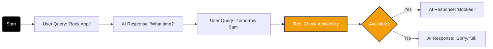

import { GitFork, Languages, MousePointer2, Play } from 'lucide-react';
import { Step, Steps } from 'fumadocs-ui/components/steps';

The **Script Builder** is a visual, graph-based editor where you define the logic of your conversation.

While the **Agent** defines the *personality* (System Prompt), the **Script** defines the *process*. It dictates what happens when a user asks a specific question, when to trigger a tool, and when to end the call.

## The Graph Logic

Iqra AI uses a node-based architecture. You build a conversation by dragging nodes onto a canvas and connecting them.

### Key Benefits
1.  **Reusability:** You can create one "Sales Script" and assign it to 50 different Agents (different voices, regions, or phone numbers).
2.  **Determinism:** Ensure specific business rules are followed (e.g., "Always ask for Name before Email") regardless of what the LLM wants to do.

## The Interface

### 1. The Canvas
The infinite workspace where you build your flow.
*   **Pan:** Click and drag on empty space.
*   **Zoom:** Mouse wheel.
*   **Context Menu:** Right-click anywhere to add a new Node.

### 2. Multi-Language Fields
Iqra AI is **Native Multi-Language**. When you add a node that involves text (like an AI Response), you will see tabs for every language enabled in your Business settings.

  

    
English

    
Arabic

  

  

    Enter the AI response in English...
  

You **must** fill in the content for all languages. This ensures that if the agent switches language mid-call, the logic flow remains intact but the content switches instantly to the correct localized text.

## Building Your First Flow

<Steps>
<Step>
### Start Node
Every script begins here. This is the entry point when the call connects.
</Step>

<Step>
### Add Interaction
Right-click and add a **User Query** node.
*   *Intent:* "I want to buy".
*   Connect the **Start Node** to this **User Query**.
</Step>

<Step>
### Add Response
Right-click and add an **AI Response** node.
*   *Text:* "Great! We have a special offer."
*   Connect the **User Query** to this **AI Response**.
</Step>
</Steps>

## Deep Dive

<Cards>
  <Card icon={<GitFork />} title="Node Reference" href="/build/script/nodes">
    A complete dictionary of all available nodes: Logic, Tools, DTMF, and SMS.
  </Card>
  <Card icon={<Languages />} title="Templating" href="/build/script/templating">
    How to use variables like `{{ customer.name }}` inside your script nodes.
  </Card>
</Cards>