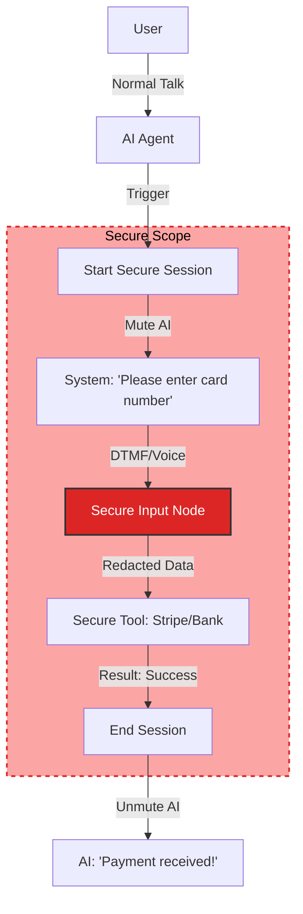

import { Shield, Lock, EarOff, CreditCard, FileText, Database } from 'lucide-react';

<Callout type="warn" title="Coming Soon!">
The Secure Session architecture is currently in active development. This documentation reflects the security design standards we are implementing.
</Callout>

**Secure Sessions** allow you to collect sensitive information—such as Credit Card numbers, Social Security Numbers (SSN), or PIN codes—without exposing that data to the AI model or your conversation logs.

## The Compliance Dilemma

Standard AI Agents are "always listening." If a user speaks their credit card number:
1.  It is sent to the STT provider (e.g., Deepgram).
2.  It is sent to the LLM (e.g., OpenAI).
3.  It is stored in the Conversation Transcript.

For highly regulated industries (Banking, Healthcare), this is a compliance violation (PCI-DSS, HIPAA).

## The Solution: The Clean Room

A Secure Session creates a temporary **"Clean Room"** within the conversation.

1.  **AI Muted:** The connection to the LLM is temporarily severed. The AI cannot "hear" or "remember" anything said inside this session.
2.  **Redacted Logs:** Inputs are masked (`****`) in the database instantly.
3.  **Direct Processing:** Data flows directly from the user to your secure API (via a specialized Tool) and is then discarded from memory.

---

## Configuration

To build a secure flow, you use specific **Security Nodes** available in the sidebar.

### 1. Start Secure Session
Defines the entry point.
*   **Audio Mode:** You can choose to switch to **DTMF Only** (Keypad) to prevent the user from accidentally speaking sensitive info, or allow **Voice** with strict redaction.

### 2. Secure Input
Collects the data.
*   **Type:** Credit Card, SSN, Numerical, Alphanumeric.
*   **Validation:** Built-in Luhn Algorithm check (for Credit Cards) to ensure the number is valid before even hitting your API.
*   **Storage:** You must map the result to a **[Script Variable](/build/script/variables)** that has the `IsRedacted` flag set to **True**.

### 3. Secure Tool
A variant of the [Custom Tool](/build/tools).
*   **Input:** Accepts the redacted variable.
*   **Output:** Returns a non-sensitive token (e.g., `transaction_id`) or status (`success`). It does *not* return the raw sensitive data.

---

## What the Agent Sees

It is important to understand the Agent's perspective during this process.

*   **Before Session:** "The user wants to pay. I am starting the payment flow."
*   **During Session:** *[Silence / Waiting]*
*   **After Session:** The System injects a system message: `Secure Session Completed. Result: Payment Successful. Transaction ID: tx_123.`

The Agent knows *that* payment happened, but it never saw *how* it happened.

## Use Cases

<Cards>
  <Card icon={<CreditCard />} title="Payments (PCI)">
    Collecting 16-digit card numbers and CVV codes. The system validates the card format locally before sending it to your Payment Gateway.
  </Card>
  
  <Card icon={<FileText />} title="Identity (PII)">
    Collecting National IDs or Social Security Numbers for identity verification.
  </Card>
  
  <Card icon={<Lock />} title="Authentication">
    Collecting OTPs or PIN codes. The value is compared against your API validation endpoint, and only the `True/False` result is shared with the AI.
  </Card>
</Cards>