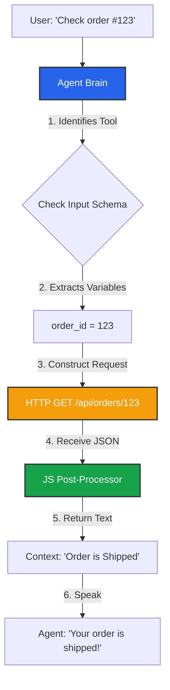

import { Hammer, Braces, Code, Database, ArrowRightLeft } from 'lucide-react';
import { Step, Steps } from 'fumadocs-ui/components/steps';

A **Custom Tool** is an API definition that the Agent can "decide" to execute during a conversation.

Unlike a hardcoded script step, the Agent uses its intelligence to trigger tools. If you define a "Check Order Status" tool, and the user says "Where is my package?", the Agent will automatically recognize the intent, ask for the Order ID (if missing), and execute the tool.

## The Tool Execution Flow



## Creating a Tool

Navigate to **Business Dashboard** -> **Tools** -> **Add Tool**.

<Steps>
<Step>
### General Information
*   **Name:** A unique identifier (e.g., `check_inventory`).
*   **Description:** **Crucial.** This tells the AI *when* to use this tool.
    *   *Bad:* "API V2 Endpoint."
    *   *Good:* "Use this tool when the user asks about the stock availability of a specific product item."
</Step>

<Step>
### Input Schema
This defines the **Variables** the agent needs to collect from the user before it can run the tool.

*   **Key (ID):** The variable name used in templating (e.g., `product_name`).
*   **Type:** String, Number, Boolean, or Date.
*   **Description:** Instructions for the AI on how to extract this.
    *   *Example:* "The name of the item the user wants to buy. Infer from context."
*   **Required:** If checked, the Agent will *ask the user* for this information if it wasn't provided in the initial query.

> **Example:** For a "Book Meeting" tool, you might need `date` (Date) and `email` (String).
</Step>

<Step>
### Configuration (The Request)
Define the HTTP Request details. You use **Scriban Templating** to inject the Input Schema variables.

*   **Method:** GET, POST, PUT, DELETE, PATCH.
*   **URL:** `https://api.mystore.com/products/{{ product_name }}`.
*   **Headers:** Add Authentication here (e.g., `Authorization: Bearer sk_...`).
*   **Body:** For POST requests, construct your JSON payload.
    ```json
    {
      "item": "{{ product_name }}",
      "quantity": 1
    }
    ```
</Step>

<Step>
### Response Handling (Post-Processing)
APIs usually return raw JSON. If you feed raw JSON to an LLM, it might read it out literally ("Curly brace quote status...").

Iqra AI provides a **JavaScript Sandbox** to parse the response into a natural language string or a simplified object.

**Available Variables:**
*   `response.status`: HTTP Status Code (e.g., 200).
*   `response.data`: The JSON body returned by the API.

**Example Code:**
```javascript
// API returns: { "stock": 50, "location": "Warehouse A" }

if (response.status === 200) {
  const stock = response.data.stock;
  if (stock > 0) {
    return `We have ${stock} units available in stock.`;
  } else {
    return "I am sorry, that item is currently out of stock.";
  }
} else {
  return "I could not check the inventory right now.";
}
```

The string returned by this function is what enters the Agent's context.
</Step>
</Steps>

## Advanced Features

### Static Response (Mocking)
For testing or simple logic, you can enable **Static Response**. Instead of making a real HTTP request, the tool will instantly return the text you define.
*   *Use Case:* Prototyping a script before the backend API is ready.

### Audio Triggers
Tools take time to run (latency). To prevent dead air, you can play a sound effect while the tool executes.
*   **Sound File:** Upload an MP3 (e.g., keyboard typing sounds, "Let me check that for you..." voice filler).
*   **Behavior:** The audio loops until the HTTP request completes.

### Execution Context
When a tool runs, it also receives context from the call. You can access these in the HTTP configuration using Scriban:
*   `{{ call.from }}`: Caller Phone Number.
*   `{{ call.session_id }}`: Unique Session ID.

This allows you to authenticate users against your database using their phone number without asking them for it.