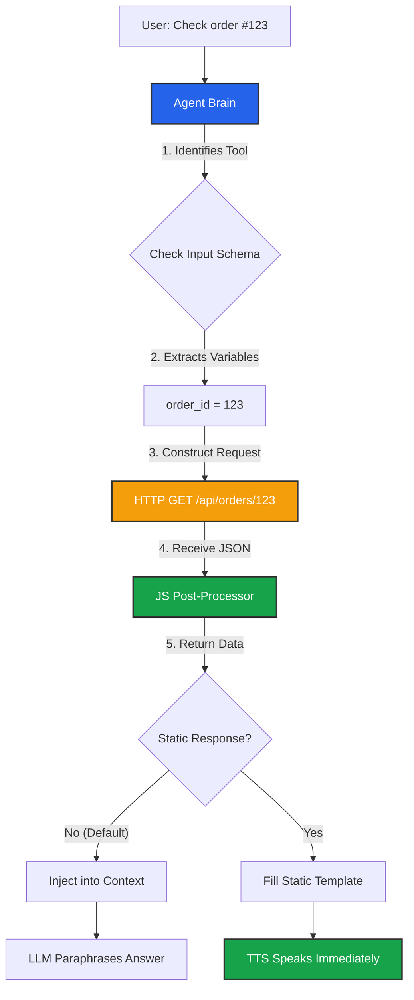

import { Hammer, Braces, Code, Database, ArrowRightLeft, Variable, Zap, Bug } from 'lucide-react';
import { Step, Steps } from 'fumadocs-ui/components/steps';

A **Custom Tool** is a raw API definition. Unlike **[FlowApps](/build/script/flowapps)** (which are pre-built plugins), Custom Tools allow you to connect to *any* HTTP endpoint, giving you total control over the request, response parsing, and latency handling.

## The Execution Flow



## Creating a Tool

Navigate to **Business Dashboard** -> **Tools** -> **Add Tool**.

<Steps>
<Step>
### General Information
*   **Name:** A unique identifier (e.g., `check_inventory`).
*   **Description:** **Crucial.** This tells the AI *when* to use this tool.
    *   *Bad:* "API V2 Endpoint."
    *   *Good:* "Use this tool when the user asks about the stock availability of a specific product item."
</Step>

<Step>
### Input Schema
Define the **Variables** the agent must collect from the user to run this tool.

*   **Key:** The variable name used in request templating (e.g., `product_name`).
*   **Type:** String, Number, Boolean, or Date.
*   **Description:** Instructions for the AI. (e.g., "The item name. Infer from context.").
*   **Required:** If checked, the Agent will ask follow-up questions to get this data if it's missing.
</Step>

<Step>
### Request Configuration
Define the HTTP Request. Use **Scriban Templating** to inject the Schema variables.

*   **Method:** GET, POST, PUT, DELETE, PATCH.
*   **URL:** `https://api.mystore.com/products/{{ product_name }}`.
*   **Headers:** Add Authentication (e.g., `Authorization: Bearer sk_...`).
*   **Body:** Construct your JSON payload.
    ```json
    {
      "item": "{{ product_name }}",
      "quantity": 1
    }
    ```
</Step>

<Step>
### Response Handling (Javascript Sandbox)
APIs return raw JSON. You must parse this into something human-readable.

**Available Variables:**
*   `response.status`: HTTP Code (e.g., 200).
*   `response.data`: The JSON body.

**Code Example:**
```javascript
// API returns: { "stock": 50, "status": "ok" }

if (response.status === 200) {
  // Return a clean string/value
  return response.data.stock;
} else {
  return "Error";
}
```
</Step>
</Steps>

---

## Latency Optimization

### Static Response (Skip the Brain)
By default, the tool result is sent back to the LLM, which "thinks" about it and generates a natural response. This adds latency (Time-to-First-Token).

You can bypass the LLM and send the result directly to the Text-to-Speech (TTS) engine.

*   **Enable Static Response:** Toggle `ON`.
*   **Template:** Define exactly what should be spoken. Use `{{ result }}` to inject the output of your JS Sandbox.
    *   *Example:* `We currently have {{ result }} units in stock.`
*   **Benefit:** Saves ~500ms-1s of latency. The agent speaks immediately after the API returns.

### Audio Triggers
Tools take time to run. To prevent "Dead Air" silence while the HTTP request is pending, you can play a sound.
*   **Sound File:** Upload an MP3 (e.g., keyboard typing sounds, or a voice saying *"Let me check that for you..."*).
*   **Behavior:** The audio loops until the HTTP request completes.

---

## Variable Mapping (Logic)

In the **Script Builder**, when you click the Custom Tool node, you can map the result to a **[Script Variable](/build/script/variables)**.

*   **Output Variable:** Select a variable (e.g., `inventory_count`).
*   **Usage:** You can now use a **Condition Node** to check `if inventory_count < 5` -> **Transfer to Agent**.

<Callout type="tip" title="Hybrid Power">
  This mapping allows you to use the AI for *Intent* (triggering the tool), but use strict *Logic* (Condition Nodes) to handle the **Result**.
</Callout>

---

## Roadmap

<Cards>
  <Card icon={<Bug />} title="Tool Debugger">
    **Coming Soon.** A built-in testing interface (top-right of the dashboard) to mock tool executions, inspect JSON payloads, and verify JS parsing logic without placing a real phone call.
  </Card>
</Cards>