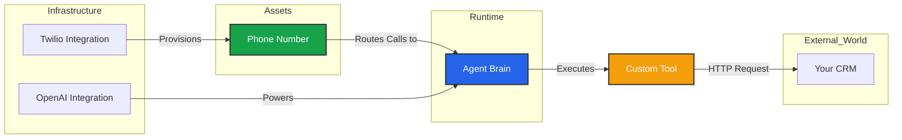

import { Hammer, Plug, Phone, ArrowRightLeft, Database, Network } from 'lucide-react';

To be useful, an Agent must be connected to the world. This section manages the **"External Interface"** of your workspace—the pipes that let data and audio flow in and out.

## The Connectivity Stack

It is important to understand the relationship between these three modules:

1.  **Integrations:** The **Keys**. (e.g., Your Twilio Account credentials).
2.  **Phone Numbers:** The **Assets**. (e.g., The specific +1 number purchased from Twilio).
3.  **Custom Tools:** The **Actions**. (e.g., A webhook to update your CRM).

## Architecture Flow

---

## Workspace Modules

<Cards>
  <Card icon={<Plug />} title="Integrations" href="/build/tools/integrations">
    **The Key Vault.** Connect third-party providers.
    *   **AI:** LLM, TTS, STT keys.
    *   **Telephony:** Twilio, Telnyx, SIP credentials.
  </Card>

  <Card icon={<Phone />} title="Phone Numbers" href="/build/tools/phone-numbers">
    **The Lines.** Manage your **BYOC (Bring Your Own Carrier)** numbers.
    *   **Region Control:** Assign numbers to specific server regions for low latency.
    *   **Webhooks:** Configure carrier routing.
  </Card>

  <Card icon={<Hammer />} title="Custom Tools" href="/build/tools/custom-tools">
    **The Hands.** Build raw HTTP webhooks to connect your agent to internal APIs.
    *   Define **Input Schemas** (what variables to send).
    *   Write **JavaScript** to parse the response into natural language.
  </Card>
</Cards>