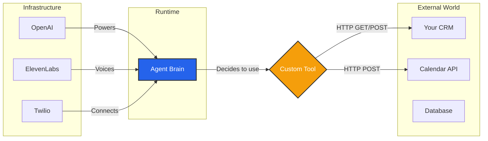

import { Hammer, Plug, Cable, ArrowRightLeft, Database } from 'lucide-react';

To build a truly useful agent, it needs to interact with the outside world. Whether it's looking up a customer order in your database, sending a calendar invite, or simply using a specific voice provider, this module handles the connections.

## The Distinction

It is important to differentiate between **Integrations** and **Tools**.

| Feature | Concept | Analogy | Example |
| :--- | :--- | :--- | :--- |
| **Integrations** | **Infrastructure** | The "Organs" | Connecting your OpenAI account, Twilio phone number, or ElevenLabs voice. |
| **Tools** | **Actions** | The "Hands" | Fetching a user profile, updating a CRM status, or booking a meeting via API. |

## Architecture Flow

## Modules

<Cards>
  <Card icon={<Hammer />} title="Custom Tools" href="/build/tools/custom-tools">
    Define **HTTP Webhooks**. Teach your agent how to talk to your API, define input schemas (variables), and process the JSON response into natural language.
  </Card>
  
  <Card icon={<Plug />} title="Manage Integrations" href="/build/tools/integrations">
    Connect your **Provider Accounts**. Manage API keys for LLMs, TTS, STT, and Telephony providers specific to this Business Workspace.
  </Card>
</Cards>

## System Tools vs. Custom Tools

When building a Script, you will see two types of tools:

1.  **System Tools:** Built-in capabilities provided by Iqra AI (e.g., End Call, Transfer, Knowledge Base Search). You do not need to configure these here.
2.  **Custom Tools:** HTTP connectors you build yourself in this module (e.g., "Check Order Status"). These appear as a **Custom Tool Node** in the Script Builder.