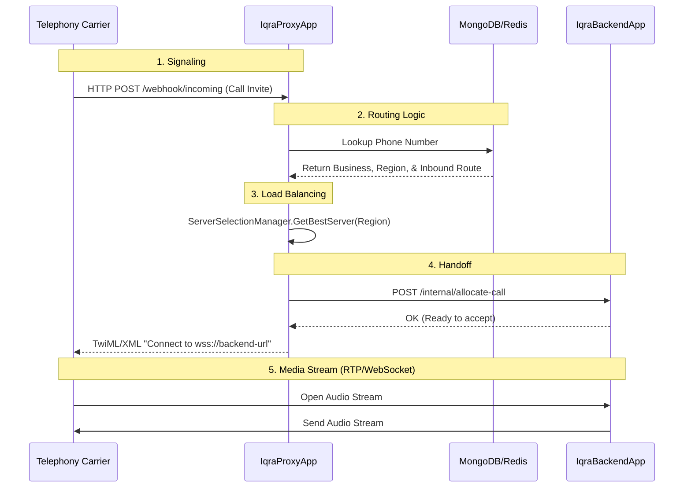
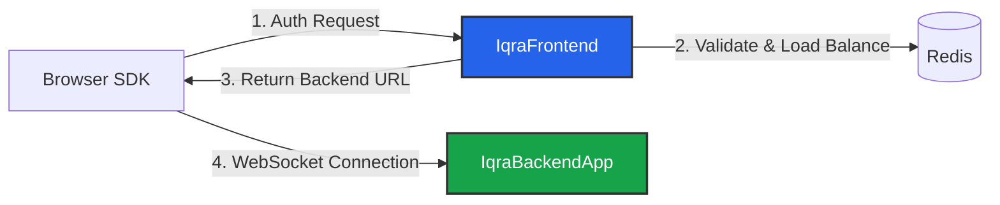

import { Network, Server, ArrowDown, Activity, Globe, PhoneIncoming } from 'lucide-react';
import { Step, Steps } from 'fumadocs-ui/components/steps';

Understanding how data moves through the Iqra AI cluster is essential for debugging latency and configuring firewalls. The flow differs depending on whether the conversation is via **Telephony** (PSTN/SIP) or the **Web** (WebRTC/WebSocket).

## Scenario A: Inbound Telephony Call

This flow is used when a human calls a phone number connected to Twilio, Telnyx, or a SIP Trunk.

### The Role of the Proxy
The **Proxy** does not touch the audio. It acts as the **Dispatcher**.
1.  **Region Check:** It sees the number is assigned to `us-east`.
2.  **Load Balancing:** It checks Redis to find a `us-east` Backend server with low CPU/Concurrency usage.
3.  **Security:** It validates the carrier's signature to ensure the request is legitimate.

---

## Scenario B: Web Session

This flow is used when a browser or mobile app initiates a session via the SDK. It bypasses the Proxy because the Frontend API handles the initial authentication.

---

## The Audio Processing Loop

Once the connection (Telephony or Web) is established to the **IqraBackendApp**, the system enters the real-time processing loop. This happens continuously for the duration of the conversation.

This logic lives inside `ConversationAIAgent.cs` and its sub-components.

<Steps>
<Step>
### Ingress (Audio Input)
Raw audio packets arrive via WebSocket or RTP.
*   **Buffer:** Audio is collected into a jitter buffer.
*   **VAD (Voice Activity Detection):** `ConversationAIAgentTurnAndInterruptionManager` analyzes the stream volume and energy.
    *   *If Silence:* Do nothing.
    *   *If Voice:* Send to STT.
</Step>

<Step>
### Perception (STT)
Audio is streamed to the provider (e.g., Deepgram).
*   **Interim Results:** Real-time text used for interruption checks ("Did the user say 'Stop'?").
*   **Final Result:** A complete sentence triggering the LLM.
</Step>

<Step>
### Cognition (LLM)
The transcript is appended to the conversation history.
*   **Context:** `ConversationAIAgentLLMHandler` injects the System Prompt and Tools.
*   **Inference:** The request is sent to the LLM (e.g., OpenAI).
*   **Streaming:** Tokens are received one by one to reduce Time-To-First-Byte.
</Step>

<Step>
### Synthesis (TTS)
As text tokens arrive from the LLM, they are buffered into sentences.
*   **Generation:** Sent to the TTS provider (e.g., ElevenLabs).
*   **Caching:** The system checks if this exact audio has been generated before. If yes, it pulls from Redis/S3.
</Step>

<Step>
### Egress (Audio Output)
The generated audio bytes are mixed with any [Background Audio](/build/agent/optimization#environment) and streamed back to the client.
</Step>
</Steps>