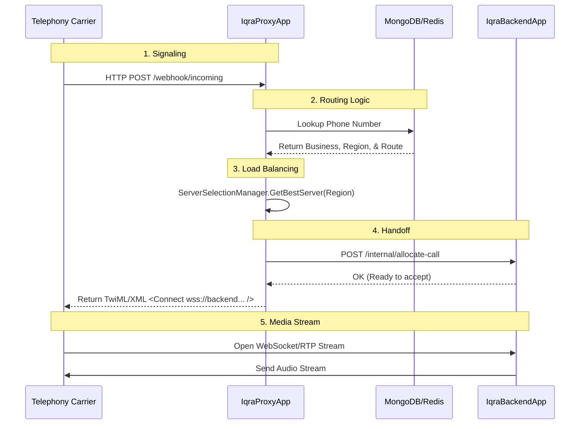
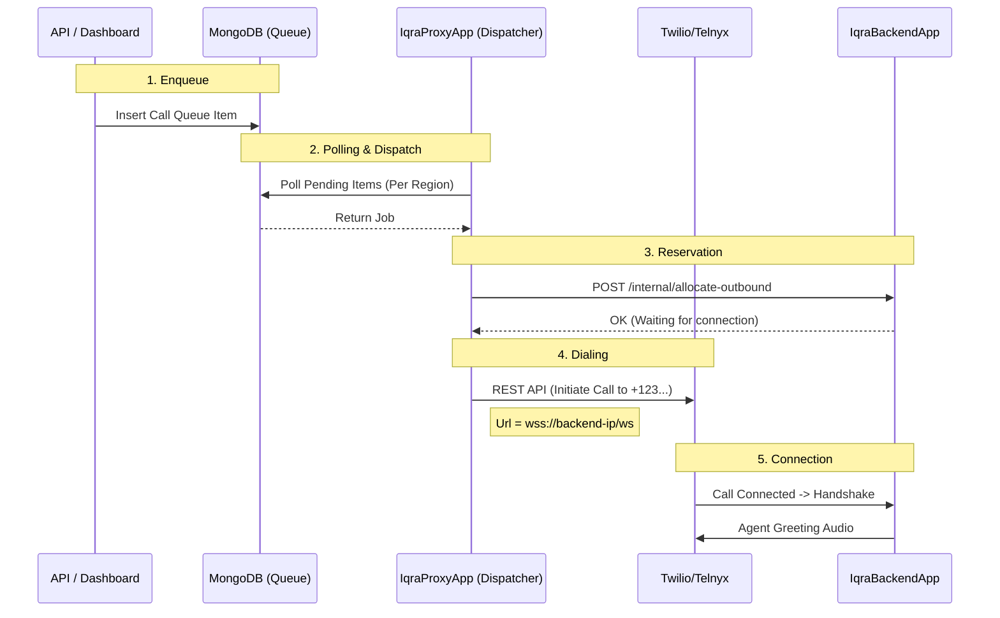
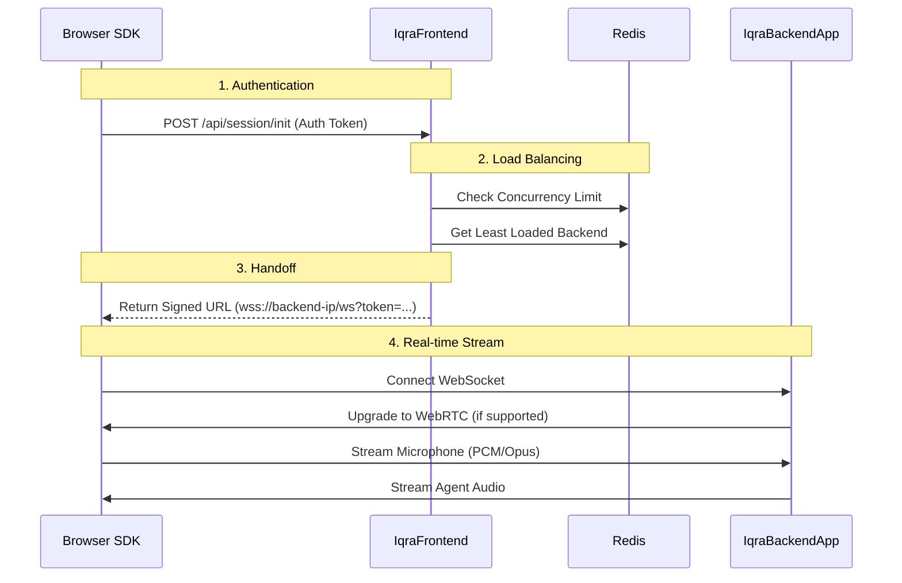

import { Network, Server, ArrowDown, Activity, Globe, PhoneIncoming, PhoneOutgoing } from 'lucide-react';
import { Step, Steps } from 'fumadocs-ui/components/steps';

Understanding how data moves through the Iqra AI cluster is essential for debugging latency, configuring firewalls, and understanding the role of the **Proxy** vs. the **Backend**.

## Scenario A: Inbound Telephony
**"The Router"**

This flow triggers when a human calls a phone number connected to your platform. The Carrier asks the Proxy where to send the audio.

---

## Scenario B: Outbound Telephony
**"The Dispatcher"**

This flow triggers when you launch a call via API or the Dashboard. It involves an asynchronous queue system.

*   **Why the Proxy dials?** The Proxy manages the global rate limits (CPS) and concurrency for the Business before the heavy Backend server is involved.

---

## Scenario C: Web Session (WebRTC)
**"The Direct Line"**

This flow bypasses the Telephony Proxy entirely. The Frontend API acts as the gatekeeper, handing a "Ticket" (Signed URL) to the browser to connect directly to the brain.

<Callout type="info" title="Latency Advantage">
  Web Sessions are significantly faster than Telephony scenarios because there is no Carrier middleware (Twilio/Telnyx) processing the audio packets. The browser speaks directly to the Iqra Backend.
</Callout>