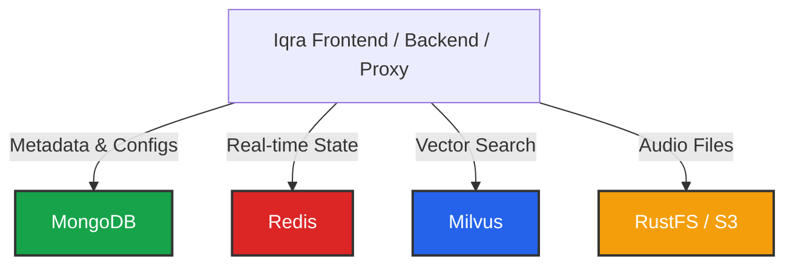

import { Database, HardDrive, Zap, FileAudio, Layers } from 'lucide-react';

Iqra AI is a **Polyglot Persistence** system. Instead of forcing all data into a single database, we use specific technologies optimized for different types of data (State vs. Documents vs. Vectors vs. Files).

## Storage Architecture

---

## 1. MongoDB (Primary Storage)
**The Source of Truth.**

MongoDB holds the persistent data for the platform. It allows for the flexible schema required by our dynamic Tool definitions and Integration configurations.

*   **Entities:** Users, Businesses, Agents, Scripts, Campaigns.
*   **Logs:** Conversation history, usage records, billing transactions.
*   **Configurations:** Serialized JSON settings for integrations (e.g., Azure keys, Twilio settings).

<Callout type="info" title="Why No SQL?">
  Iqra AI allows users to define custom **Input Schemas** for tools and dynamic **Extraction Schemas** for analysis. A document store like MongoDB handles these varying structures natively without complex migrations.
</Callout>

---

## 2. Redis (Hot Storage)
**The Speed Layer.**

Redis is used for data that needs sub-millisecond access or expires quickly. It is the nervous system of the cluster.

*   **Concurrency Tracking:** Real-time counters of active calls per business (used by the Proxy for rate limiting).
*   **Session State:** Ephemeral data about currently active conversations.
*   **Audio Buffers:** Temporary holding ground for audio chunks before processing.
*   **Queues:** Distributed lists for processing Bulk Outbound Calls.
*   **Short-term Cache:** Caching frequent DB queries (e.g., "Get Agent Config") to reduce load on MongoDB.

---

## 3. Milvus (Vector Database)
**The Memory.**

Milvus is a high-performance vector database used exclusively for **RAG (Retrieval Augmented Generation)**.

*   **Embeddings:** When you upload a document to the Knowledge Base, it is chunked, converted into vectors (numbers representing meaning), and stored here.
*   **Retrieval:** During a call, the Agent converts the user's query into a vector and queries Milvus for the "Nearest Neighbors" (most relevant text chunks).

---

## 4. RustFS / S3 (Object Storage)
**The Warehouse.**

For large binary files, we use an S3-compatible object storage. By default, the Open Source setup uses **RustFS** (a lightweight file server), but this can be swapped for AWS S3, MinIO, or Azure Blob Storage in the configuration.

*   **Recordings:** MP3 files of completed calls.
*   **Assets:** Business logos, Agent background audio tracks.
*   **Audio Cache:** Pre-generated TTS files.
    *   *Note:* The backend often uses a local Redis instance as a "Level 1" cache for audio before offloading to S3 for "Level 2" long-term storage.