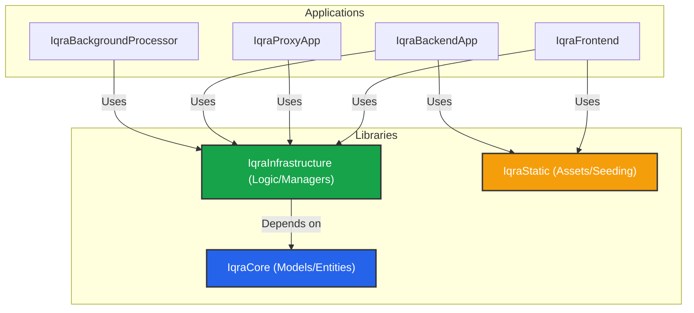

import { Box, Layers, Server, Code, Cpu, Archive } from 'lucide-react';

Iqra AI is a **Modular Monolith** built on **.NET**. While it consists of multiple deployable services, they share a common codebase through shared libraries. This ensures consistency in data models and business logic across the entire cluster.

## Solution Hierarchy

The solution is divided into **Libraries** (The Foundation) and **Applications** (The Runtime).

## Shared Libraries

The logic of Iqra AI lives here. The Applications are simply hosts/controllers that invoke this logic.

### 1. IqraCore
**"The What"**
Contains only POCOs (Plain Old CLR Objects), Interfaces, and DTOs.
*   **Entities:** Database models (e.g., `BusinessEntity`, `AgentEntity`).
*   **Models:** Request/Response objects for APIs.
*   **Interfaces:** Contracts for services.

### 2. IqraInfrastructure
**"The How"**
Contains the heavy lifting. If you are looking for "where the code is," it is likely here.
*   **Managers:** Business logic (e.g., `BusinessManager`, `ConversationManager`).
*   **Audio Utils:** PCM conversion, resampling, and buffer management.
*   **Providers:** Implementations for LLM, TTS, STT services.

### 3. IqraStatic
**"The Assets"**
Contains static resources required by the runtime.
*   **Seeding Data:** JSON files used to populate the database with default languages and integration definitions on startup.
*   **Local AI Models:** Binary files for on-device logic (e.g., `.onnx` models for Silero VAD or Voicemail Detection) used by the Backend App.

---

## Application Services

These are the executable ASP.NET projects that make up the cluster.

| Project | Role |
| :--- | :--- |
| **ProjectIqraFrontend** | **The UI.** Serves the HTML dashboards (`.cshtml`), handles User/Business management APIs, and acts as the entry point for WebRTC web sessions. |
| **ProjectIqraProxyApp** | **The Gateway.** A lightweight edge service. It receives telephony webhooks (Twilio/SIP), performs authentication, checks billing, and routes the call to the correct **Backend** server based on load and region. |
| **ProjectIqraBackendApp** | **The Brain.** The compute-heavy node. It maintains the WebSocket/RTP connection, processes audio streams, runs VAD, and talks to AI providers. |
| **IqraBackgroundProcessor** | **The Janitor.** The service that runs background jobs: cleaning up stale sessions, processing heavy post-analysis tasks, and syncing usage logs. |