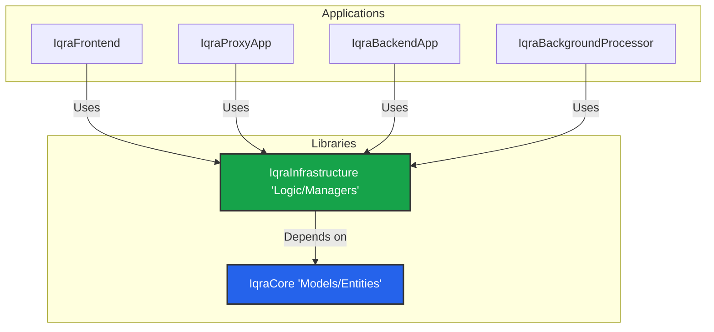

import { Box, Layers, Server, Code, Cpu } from 'lucide-react';

Iqra AI is a **Modular Monolith** built on **.NET 8**. While it consists of multiple deployable services, they share a common codebase through shared libraries. This ensures consistency in data models and business logic across the entire cluster.

## Solution Hierarchy

The solution is divided into **Libraries** (The Foundation) and **Applications** (The Runtime).

## Shared Libraries

The logic of Iqra AI lives here. The Applications are simply hosts/controllers that invoke this logic.

### 1. IqraCore
**"The What"**
Contains only POCOs (Plain Old CLR Objects), Interfaces, and DTOs.
*   **Entities:** Database models (e.g., `BusinessEntity`, `AgentEntity`).
*   **Models:** Request/Response objects for APIs.
*   **Interfaces:** Contracts for services.

### 2. IqraInfrastructure
**"The How"**
Contains the heavy lifting. If you are looking for "where the code is," it is likely here.
*   **Managers:** Business logic (e.g., `BusinessManager`, `ConversationManager`).
*   **Audio Utils:** PCM conversion, resampling, and buffer management.
*   **Providers:** Implementations for LLM, TTS, STT services.

---

## Application Services

These are the executable projects (`.exe` / Docker containers).

| Project | Type | Role |
| :--- | :--- | :--- |
| **ProjectIqraFrontend** | ASP.NET MVC | **The UI.** Serves the HTML dashboards (`.cshtml`), handles User/Business management APIs, and acts as the entry point for WebRTC web sessions. |
| **ProjectIqraProxyApp** | ASP.NET Core | **The Gateway.** A lightweight edge service. It receives telephony webhooks (Twilio/SIP), performs authentication, checks billing, and routes the call to the correct **Backend** server based on load and region. |
| **ProjectIqraBackendApp** | ASP.NET Core | **The Brain.** The compute-heavy node. It maintains the WebSocket/RTP connection, processes audio streams, runs VAD, and talks to AI providers. |
| **IqraBackgroundProcessor** | Worker | **The Janitor.** Runs background jobs: cleaning up stale sessions, processing heavy post-analysis tasks, and syncing usage logs. |

---

## Core Logic Deep Dive

For contributors, here are the critical classes that drive the Voice AI engine.

### The Agent Brain
Located in: `IqraInfrastructure/Managers/Conversation/Session/Agent/AI`

*   **`ConversationAIAgent.cs`**: The master controller for a single conversation. It coordinates hearing, thinking, and speaking.
*   **`ConversationAIAgentTurnAndInterruptionManager.cs`**: The referee. It decides when the user has finished talking (Turn-End) and handles barge-in logic.
*   **`ConversationAIAgentLLMHandler.cs`**: Manages the context window, injects system prompts, and handles the streaming response from the LLM.
*   **`ConversationAIAgentToolExecutor.cs`**: Detects tool calls from the LLM, executes the HTTP request, and feeds the result back into the context.

### The Provider Factory
Located in: `IqraInfrastructure/Managers/<Type>/Providers`

Iqra AI uses a **Dynamic Factory Pattern** to load integrations.
*   **Manager:** `LLMProviderManager.cs` takes a configuration object (e.g., "Provider: OpenAI") and instantiates the correct service.
*   **Service:** `OpenAILLMService.cs` implements the standard interface to send prompts and receive streams.

This allows us to add new providers (e.g., Anthropic) by simply adding a new Service class and registering it in the database, without rewriting the core agent logic.

### Server Selection (Load Balancing)
Located in: `IqraInfrastructure/Managers/Server/ServerSelectionManager.cs`

When the **Proxy** receives a call, it asks this manager: *"Which Backend server in this Region has capacity?"*
*   It checks the `ExpectedMaxConcurrentCalls` setting.
*   It checks the current load (active sessions) in Redis.
*   It returns the URL of the least-loaded Backend server.