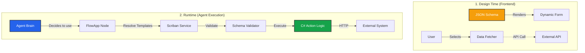

import { Blocks, FileJson, Code, Database, LayoutTemplate } from 'lucide-react';

**FlowApps** are the plugin engine of Iqra AI. They allow you to add new capabilities—like booking a meeting on Cal.com, sending a message to Slack, or updating a HubSpot contact—directly into the [Script Builder](/build/script).

Unlike simple "HTTP Request" nodes where the user has to copy-paste URLs and Headers manually, FlowApps provide a **Native UI Experience** with dropdowns, validation, and authentication management.

## The Philosophy: Code-First, Schema-Backed

We designed the FlowApp system to solve a specific problem: **How do we create rich, dynamic UIs on the frontend without writing React code for every new integration?**

The solution is a hybrid architecture:
1.  **Logic (C#):** You write the execution code in .NET for type safety and performance.
2.  **UI (JSON Schema):** You define the inputs using standard JSON Schema. The Frontend reads this schema and **auto-generates the form**.



## Directory Structure

All FlowApps live within the `IqraInfrastructure` library. To add a new app, you simply create a folder structure. The system uses **Reflection** to discover your app automatically on startup.

```text
IqraInfrastructure/
└── Managers/
    └── FlowApp/
        └── Apps/
            ├── CalCom/                  <-- The App Container
            │   ├── CalComApp.cs         // Implements IFlowApp
            │   ├── Models/
            │   │   └── CalComModels.cs  // Request/Response DTOs
            │   ├── Actions/             <-- Executable Functions
            │   │   ├── BookMeeting.cs
            │   │   ├── BookMeeting.json // The UI Definition
            │   │   ├── GetSlots.cs
            │   │   └── GetSlots.json
            │   └── Fetchers/            <-- Dynamic Dropdown Logic
            │       ├── GetUsersFetcher.cs
            │       └── GetEventTypesFetcher.cs
            └── HubSpot/
                └── ...
```

## Management & Permissions

While apps are defined in code, their **Availability** is controlled via the Database.

*   **Code Definition (Immutable):** Defines *how* the app works.
*   **Database Overlay (Mutable):** Defines *if* the app works.

The `FlowAppManager` merges these two sources. This allows Admins to:
1.  **Disable** a specific Action (e.g., "BookMeeting") if an API bug is discovered, without redeploying the backend.
2.  **Mark** an App as "Maintenance Mode" with a public reason displayed to users.

## Core Components

Building a FlowApp involves three distinct parts.

<Cards>
  <Card icon={<Blocks />} title="1. The App Container" href="/developers/flowapp/create-app">
    The entry point. Defines metadata (Icon, Name) and handles **Authentication** validation.
  </Card>
  
  <Card icon={<Code />} title="2. Actions" href="/developers/flowapp/create-action">
    The logic. Defines what the node *does* (e.g. "Create Booking"). Includes the **JSON Schema** for the input form and the **C# Code** to execute the API call.
  </Card>
  
  <Card icon={<Database />} title="3. Data Fetchers" href="/developers/flowapp/data-fetchers">
    The UI magic. Replaces text inputs with **Dynamic Dropdowns** (e.g. selecting a "User" from a list fetched from the API) to improve user experience.
  </Card>
</Cards>