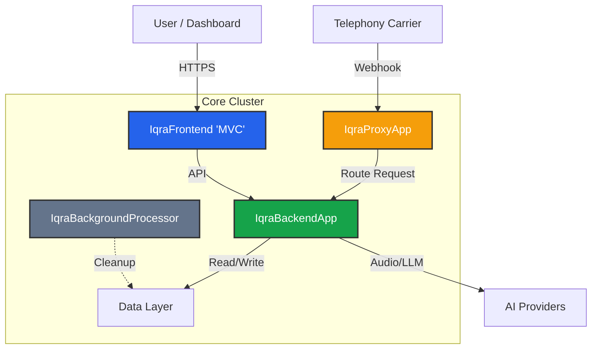

import { Cpu, Code, Server, Network, Database, Layers, Blocks } from 'lucide-react';

Welcome to the Developer Hub. Whether you are building a client-side application using our SDKs or deploying the full Open Source platform on your own infrastructure, this is your starting point.

Iqra AI is built on **.NET (C#)**. It is designed as a distributed, multi-region system capable of horizontal scaling.

## High-Level Architecture

The platform consists of four primary services communicating over HTTP and interacting with a shared data layer.

## Core Services

| Service | Technology | Role |
| :--- | :--- | :--- |
| **IqraFrontend** | ASP.NET MVC | Serves the User and Business Dashboards. Handles client-side API requests and UI rendering. |
| **IqraProxyApp** | ASP.NET Core | The **Gateway**. Handles inbound telephony webhooks, route lookups, billing checks, and forwards requests to the correct regional backend. |
| **IqraBackendApp** | ASP.NET Core | The **Brain**. Handles the real-time conversation logic, audio processing (ingress/egress), and orchestration of LLM/TTS/STT services. |
| **IqraBackground** | Worker Service | Handles queue cleanup, stale session termination, and asynchronous maintenance tasks. |

## Data Layer

The platform relies on a specific stack of persistence technologies:
*   **MongoDB:** Primary storage for Users, Businesses, Agents, and Logs.
*   **Redis:** Hot storage for active sessions, audio buffers, and real-time state.
*   **Milvus:** Vector database for RAG (Retrieval Augmented Generation).
*   **RustFS / S3:** Object storage for recordings, assets, and cache files.

## Developer Resources

<Cards>
  <Card icon={<Blocks />} title="FlowApp Development" href="/developers/flowapp">
    **Build Plugins.** Learn how to create new integrations (like Cal.com or HubSpot) using our C# + JSON Schema architecture.
  </Card>

  <Card icon={<Network />} title="API Reference" href="/api-reference">
    Interactive OpenAPI documentation. Test endpoints for call initiation, history retrieval, and management.
  </Card>
  
  <Card icon={<Code />} title="SDKs & Middleware" href="/developers/sdks/web-widget">
    Client libraries for React/JS and the .NET Middleware for secure rate-limiting and queuing.
  </Card>
  
  <Card icon={<Server />} title="Self-Hosting" href="/developers/self-hosting">
    Deploy the Open Source version. Guides for Docker, Windows/Linux setup, and configuration.
  </Card>
  
  <Card icon={<Layers />} title="Architecture Deep Dive" href="/developers/architecture">
    Understand the code structure (`IqraCore`, `IqraInfrastructure`) and data flow.
  </Card>
</Cards>