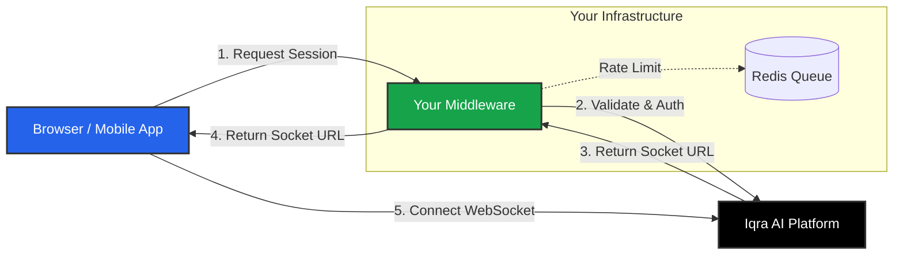

import { Globe, Shield, Code, Smartphone, Layers } from 'lucide-react';

Iqra AI provides a suite of SDKs to help you embed Voice AI capabilities into your own applications.

Whether you are building a "Talk to Sales" button on your website or a custom mobile app, our SDKs handle the complex real-time audio protocols (WebRTC/WebSocket) and state management for you.

## The Security Architecture

Unlike standard REST APIs, Voice AI sessions require strict security and concurrency management. You **cannot** connect a browser widget directly to the Iqra AI Platform because:
1.  **Security:** It would expose your API Secret Key to the public.
2.  **Concurrency:** You need a queuing system if too many users call at once.

We enforce a **Middleware Pattern**:

## Available Libraries

We provide both sides of this architecture.

### Frontend (Client)
<Cards>
  <Card icon={<Globe />} title="Web Widget SDK" href="/developers/sdks/web-widget">
    A framework-agnostic JavaScript library.
    *   **Modes:** Inline Form (Turnkey) or Headless (Custom UI).
    *   **Features:** Audio streaming, Microphone permissions, Queue state handling.
  </Card>
</Cards>

### Backend (Server)
<Cards>
  <Card icon={<Shield />} title=".NET Middleware" href="/developers/sdks/middleware">
    A production-ready ASP.NET Core solution.
    *   **Features:** IP Blocking (VPN/Proxy), Rate Limiting, Redis-based Queuing (SignalR).
    *   **Usage:** Deploy as a standalone API or import the Services into your existing .NET app.
  </Card>
</Cards>

## Roadmap

We are actively working on expanding our ecosystem to other languages and platforms.

<Cards>
  <Card icon={<Code />} title="Python / Node.js" href="/developers/sdks/clients">
    *Coming Soon.* Middleware implementations for Python (FastAPI) and Node.js (Express).
  </Card>
  <Card icon={<Smartphone />} title="Mobile SDKs" href="/developers/sdks/clients">
    *Coming Soon.* Native bindings for React Native, Flutter, iOS (Swift), and Android (Kotlin).
  </Card>
</Cards>