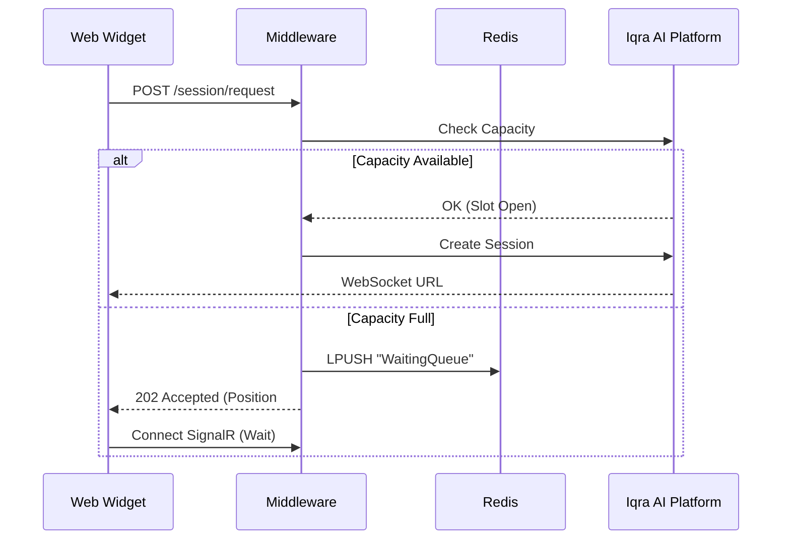

import { Shield, Server, ListOrdered, Code, Lock } from 'lucide-react';
import { Step, Steps } from 'fumadocs-ui/components/steps';

The **Iqra AI Middleware** is a production-ready ASP.NET Core application. It acts as the gatekeeper for your Web Campaigns.

Instead of exposing your API keys to the browser, the [Web Widget](/developers/sdks/web-widget) talks to this middleware. The middleware validates the request, checks for fraud (VPN/Proxy), handles queuing if the system is busy, and *then* contacts Iqra AI.

## Key Features

<Cards>
  <Card icon={<Lock />} title="Security">
    **IP Validation:** Integrated with `ipapi.is` to block VPNs, Proxies, and Tor nodes.
    **Rate Limiting:** Configurable hourly/daily limits per IP.
  </Card>
  <Card icon={<ListOrdered />} title="Distributed Queuing">
    Uses **Redis** and **SignalR**. If your agent reaches max concurrency, new users are placed in a FIFO queue and notified in real-time when a slot opens.
  </Card>
  <Card icon={<Code />} title="Embedded Mode">
    The core logic is decoupled from the HTTP layer, allowing you to inject the services directly into your existing .NET applications.
  </Card>
</Cards>

---

## Configuration (`appsettings.json`)

To run the middleware, you must configure your secrets and rules.

```json
{
  "RedisConnectionString": "localhost:6379", // Required for Queues & Rate Limits

  "VoiceAiPlatform": {
    "ApiSecretToken": "YOUR_IQRA_API_KEY", // From User Dashboard
    "BaseUrl": "https://app.iqra.bot/api/v1/",
    "BusinessId": "biz_123",
    "WebCampaignId": "camp_web_456",
    "DefaultRegionId": "us-east-1"
  },

  "IpApi": {
    "ApiKey": "YOUR_IPAPI_KEY", // Optional: For VPN detection
    "BaseUrl": "https://api.ipapi.is/"
  },

  "Security": {
    "RateLimitHourly": 20,
    "BlockVpn": true,
    "BlockProxy": true
  }
}
```

---

## The Queuing Architecture

One of the most complex problems in Voice AI is **Concurrency**. If you have 50 agent slots but 100 users on your website click "Talk", you cannot drop the extra 50 users.

The middleware handles this via a **Redis List** and **SignalR**.



**How the Queue Drains:**
1.  A call finishes on Iqra AI.
2.  Iqra AI sends a webhook `POST /api/webhook/session-ended` to the Middleware.
3.  Middleware pops the next user from Redis.
4.  Middleware sends the "Start Call" signal via SignalR to that specific waiting user.

---

## Embedded Usage (Internal SDK)

If you already have a .NET application (e.g., a SaaS backend), you might not want to deploy a separate middleware container. You can simply import the **Services** layer.

### 1. Register Services
In your `Program.cs`:

```csharp
using VoiceAiMiddleware.Services;

// Redis is required
builder.Services.AddStackExchangeRedisCache(o => o.Configuration = "...");

// Register Core Logic
builder.Services.AddScoped<IVoiceAiPlatformService, VoiceAiPlatformService>();
builder.Services.AddSingleton<IConcurrencyService, ConcurrencyService>();
```

### 2. Inject & Use
In your Controller or Service:

```csharp
public class CallController : ControllerBase
{
    private readonly IVoiceAiPlatformService _voiceService;

    public CallController(IVoiceAiPlatformService voiceService)
    {
        _voiceService = voiceService;
    }

    [HttpPost("start")]
    public async Task<IActionResult> StartCall()
    {
        var config = new WebSessionConfig(
            WebCampaignId: "camp_123",
            RegionId: "us-east-1",
            DynamicVariables: new Dictionary<string, object> { { "Name", "Ali" } }
        );

        // Get the WebSocket URL directly
        var url = await _voiceService.InitiateWebSessionAsync(config);
        
        return Ok(new { url });
    }
}
```