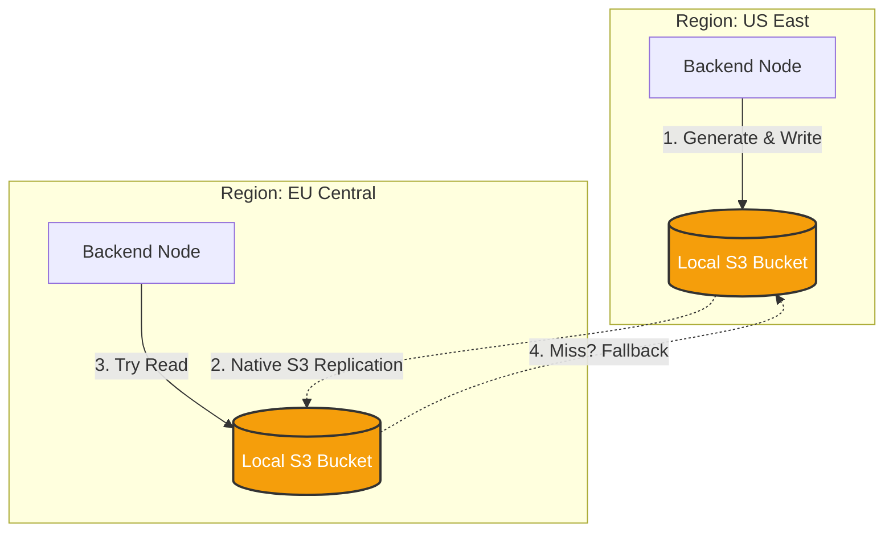

import { Database, Container, HardDrive, AlertTriangle, FileText, Zap, Github, Network } from 'lucide-react';
import { Step, Steps } from 'fumadocs-ui/components/steps';

Before you run the Iqra AI applications, you must have the **Data Layer** running. This layer holds all state, vector embeddings, binary files, and document processing capabilities.

## The Stack

| Service | Default Port | Usage |
| :--- | :--- | :--- |
| **MongoDB** | `27017` | Persistent storage for users, businesses, and logs. |
| **Redis** | `6379` | Real-time concurrency tracking, audio buffering, and queues. |
| **Milvus** | `19530` | Vector database for RAG Knowledge Base. |
| **RustFS / S3** | `9000` | S3-compatible object storage for recordings and assets. |
| **Docling** | `8000` | AI Document Parser (PDF/Docx -> Markdown) for RAG ingestion. |

---

## Setup Guide

We maintain up-to-date Docker configurations in our GitHub repository.

<Steps>
<Step>
### Download Configuration
Clone the repository and navigate to the docker folder.

```bash
git clone https://github.com/abdofallah/IqraAI.git
cd IqraAI/docker/dependencies
```
</Step>

<Step>
### Configure Environment
1.  Copy the example env file: `cp .env.example .env`
2.  **Security Warning:** Change the default `MONGO_PASSWORD` and `RUSTFS_SECRET_KEY` immediately.
</Step>

<Step>
### Start Infrastructure
```bash
docker-compose up -d
```
*Tip: The first run involves downloading large images for Milvus and Docling. Please be patient.*
</Step>
</Steps>

---

## Regional Storage Strategy (Advanced)

For a single-node setup, one S3/RustFS container is sufficient. However, for **Production Multi-Region** deployments, Iqra AI supports a distributed storage architecture to minimize audio latency.

### The Architecture: Write Local, Replicate Async

When an agent in `US-East` generates a TTS audio file, we shouldn't fetch it from `EU-Central` every time.



### How it works
1.  **Configuration:** You define a specific S3 Bucket/Connection for **each Region** in the [Admin Dashboard](/developers/admin/infrastructure).
2.  **Write:** The Backend always writes to its **Local Region** storage. It tags the file metadata with `OriginRegion: us-east`.
3.  **Replication:** You configure your storage provider (AWS S3, MinIO, or RustFS Cluster) to replicate data across buckets in the background.
4.  **Read:** When retrieving a file (e.g., Audio Cache):
    *   **Attempt 1:** Try the **Local Region** storage (Fastest).
    *   **Attempt 2:** If missing (replication lag), fallback to the **Origin Region** storage (Slower, but guarantees availability).

---

## Connection Strings Reference

You will need these values for the [Application Configuration](/developers/self-hosting/configuration).

*   **Host:** If apps run in Docker on the same network -> Use Service Name (e.g., `mongodb`).
*   **Host:** If apps run Native -> Use `localhost` or Docker Host IP.

| Service | Connection String Template |
| :--- | :--- |
| **MongoDB** | `mongodb://<user>:<pass>@localhost:27017` |
| **Redis** | `localhost:6379,password=<pass>` |
| **Milvus** | Host: `localhost`, Port: `19530` |
| **Docling** | `http://localhost:8000` |
| **Storage** | *Configured dynamically per region in Admin Dashboard.* |