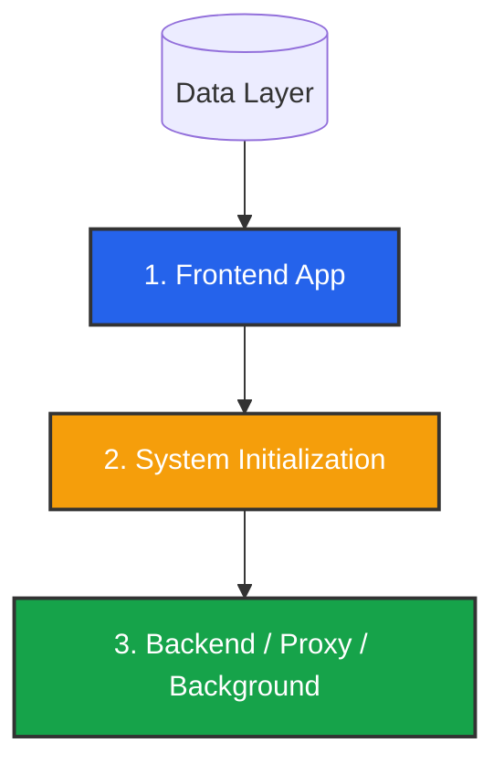

import { Server, Terminal, ShieldAlert, Network, Play, PauseCircle, FileText } from 'lucide-react';
import { Step, Steps } from 'fumadocs-ui/components/steps';

For production environments, we recommend a **Manual Binary Deployment** managed by **Systemd** (Linux) or **Windows Services**.

**Why?**
1.  **Process Control:** We rely on OS-level signals (`SIGINT`) for **Graceful Shutdowns**. If you restart a server, the app will stop accepting *new* calls but keep *active* calls alive until they finish. Docker often kills processes too aggressively.
2.  **Audio Latency:** Running natively ensures RTP packets reach the kernel immediately without NAT overhead.

---

## 1. Getting the Artifacts

Download the latest `.zip` release from our [GitHub repository](https://github.com/abdofallah/IqraAI/releases) or build from source.

*   `iqra-frontend-linux-x64.zip`
*   `iqra-proxy-linux-x64.zip`
*   `iqra-backend-linux-x64.zip`
*   `iqra-background-linux-x64.zip`

**Recommended Directory Structure:**
```text
/opt/iqra/
  ├── frontend/
  ├── proxy/
  ├── backend/
  └── background/
```

---

## 2. Deployment Order (Critical)

You cannot simply turn everything on at once. The system has a strict dependency chain.



1.  **Frontend:** Must run first to seed the database and create the Admin account.
2.  **Initialization:** You must log in and register the server topology.
3.  **Workers:** Only then can the Backend and Proxy start (they check the registry on boot).

---

## Step 1: Deploy Frontend

<Steps>
<Step>
### Install & Configure
Extract the binary to `/opt/iqra/frontend`. Edit `appsettings.json` to point to your Data Layer.
</Step>

<Step>
### Create Service
Create `/etc/systemd/system/iqra-frontend.service`.

```ini
[Unit]
Description=Iqra AI Frontend
After=network.target

[Service]
WorkingDirectory=/opt/iqra/frontend
ExecStart=/opt/iqra/frontend/ProjectIqraFrontend
Restart=always
RestartSec=10
User=root
Environment=ASPNETCORE_ENVIRONMENT=Production
Environment=ASPNETCORE_URLS=http://localhost:5000

[Install]
WantedBy=multi-user.target
```
</Step>

<Step>
### Start Service
```bash
sudo systemctl enable --now iqra-frontend
```
</Step>
</Steps>

---

## Step 2: Reverse Proxy (SSL)

We recommend running **all services** behind Nginx to handle SSL and WebSockets securely.

```nginx title="/etc/nginx/sites-available/iqra"
# 1. Frontend (Dashboard)
server {
    listen 443 ssl http2;
    server_name app.your-domain.com;
    # ... SSL Params ...

    location / {
        proxy_pass http://localhost:5000;
        proxy_http_version 1.1;
        proxy_set_header Upgrade $http_upgrade;
        proxy_set_header Connection "upgrade";
        proxy_set_header Host $host;
        proxy_set_header X-Forwarded-For $proxy_add_x_forwarded_for;
    }
}

# 2. Proxy App (Telephony Webhooks)
server {
    listen 443 ssl http2;
    server_name proxy.your-domain.com;
    # ... SSL Params ...

    location / {
        proxy_pass http://localhost:5001;
    }
}
```

---

## 🛑 Step 3: The Critical Pause

<Callout type="error" title="STOP HERE">
  **Do not deploy the Backend, Proxy, or Background apps yet.**
  
  They will crash immediately because they are not registered in the database.
  
  1.  Start the **Frontend** service.
  2.  Go to the **[Initialization Guide](/developers/self-hosting/initialization)**.
  3.  Create your Admin Account and Register your Infrastructure.
  4.  Come back here once you have generated the **Region Server IDs, ApiKey**.
</Callout>

---

## Step 4: Deploy Worker Nodes

For **Proxy**, **Backend**, and **Background**, follow the same installation pattern as the Frontend, but with specific configurations.

### Configuration Checklist
Ensure `appsettings.json` matches the values you just generated in the Admin Dashboard.

| Setting | Requirement |
| :--- | :--- |
| `Id` | **Must Match** the UUID generated in Admin Dashboard. |
| `RegionId` | **Must Match** the Region Identifier (e.g., `OM-MCT`). |
| `ApiKey` | **Must Match** the server Secret Key. |

### Service Templates (Systemd)

Use this template for Proxy, Backend, and Background. Just change the `Description`, `WorkingDirectory`, `ExecStart`, and `Port`.

```ini title="/etc/systemd/system/iqra-backend.service"
[Unit]
Description=Iqra AI Backend
After=network.target

[Service]
WorkingDirectory=/opt/iqra/backend
ExecStart=/opt/iqra/backend/ProjectIqraBackendApp
Restart=always
RestartSec=10

# Graceful Shutdown Logic
# 1. Send SIGINT (App stops accepting new calls)
KillSignal=SIGINT
# 2. Wait 10 Minutes for active calls to finish
TimeoutStopSec=600

User=root
Environment=ASPNETCORE_ENVIRONMENT=Production
# Use different internal ports for each app (e.g. 5002 for Backend)
Environment=ASPNETCORE_URLS=http://localhost:5002

[Install]
WantedBy=multi-user.target
```

**Port Mapping Recommendation:**
*   **Frontend:** `5000`
*   **Proxy:** `5001`
*   **Backend:** `5002`
*   **Background:** `5003`

---

## Firewall Rules

You must open ports for external traffic.

| Service | Protocol | Port | Description |
| :--- | :--- | :--- | :--- |
| **Nginx** | TCP | `443` | All HTTPS traffic (Dashboard, Webhooks, WebSockets). |
| **Proxy** | UDP/TCP | `5060`* | **SIP Signaling.** *Defined in Admin Dashboard.* |
| **Backend** | UDP/TCP | `5080`* | **SIP Signaling.** *Defined in Admin Dashboard.* |
| **Backend** | UDP | `10000-20000` | **RTP Media.** Critical for audio. Must be open to 0.0.0.0/0. |

<Callout type="warn" title="SIP Ports">
  The SIP ports (5060/5080) are configured inside the **Admin Dashboard** when you register the server. Ensure your firewall allows traffic on whatever port you choose there.
</Callout>