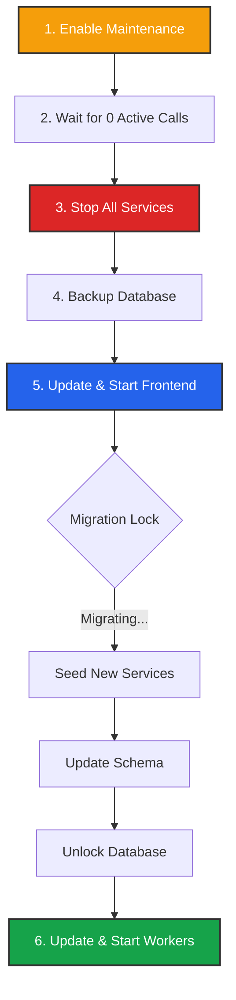

import { RefreshCw, Database, ShieldAlert, Activity, ServerCrash, Lock, PauseCircle } from 'lucide-react';
import { Step, Steps } from 'fumadocs-ui/components/steps';

Managing a distributed system requires a disciplined approach to updates. This guide covers how to move from Version X to Version Y safely without dropping active calls.

## The Maintenance Workflow

Before you touch the terminal, you should logically stop traffic.

### 1. Draining Nodes (Maintenance Mode)
The safest way to update is to stop *new* work while letting *old* work finish.

1.  **Global Maintenance:** Log in to the **Admin Dashboard** -> **Settings**.
2.  **Toggle Maintenance:** Enable **"Platform Maintenance"**.
    *   **Effect:** The Proxy rejects all *new* Inbound/Outbound call requests.
    *   **Active Calls:** Existing calls continue uninterrupted.
3.  **Monitor:** Watch the **Real-time Dashboard**. Wait until "Active Calls" drops to 0.

<Callout type="tip" title="Regional Updates">
  You can also toggle Maintenance for a **specific Region** or even a **specific Backend Node** in the Infrastructure tab if you are doing a rolling update (A/B deployment) instead of a full system upgrade.
</Callout>

---

## The Update Strategy

Iqra AI uses a **"Frontend-Led Migration"** strategy.

*   **The Leader:** The **Frontend App** is the only service authorized to modify the database schema or seed new data.
*   **The Followers:** The **Proxy, Backend, and Background** apps are consumers. They check the database version on startup.

<Callout type="error" title="Critical Safety Rule">
  **Never** update the Worker Nodes (Backend/Proxy) before the Frontend.
  
  If a Worker starts up and sees a version mismatch in the database (e.g., App is v1.2, DB is v1.1), it will **refuse to start** to prevent data corruption.
</Callout>

### The Migration Workflow



---

## Performing an Update

<Steps>
<Step>
### 1. Drain & Stop
Once maintenance mode is active and calls are zero:

```bash
# Example Systemd
sudo systemctl stop iqra-backend iqra-proxy iqra-background iqra-frontend
```
</Step>

<Step>
### 2. Backup Data
Always backup your MongoDB before a migration.

```bash
mongodump --uri="mongodb://..." --out=/backup/iqra_v1_0
```
</Step>

<Step>
### 3. Update & Start Frontend
Download the new `iqra-frontend` binary, replace the old files, and start the service.

*   **Watch the Logs:** The logs will show `Starting Database Migration...`.
*   **Wait:** Do not proceed until you see `Migration Completed. App Version: 1.x.x`.
</Step>

<Step>
### 4. Update & Start Workers
Once the Frontend is healthy:
1.  Replace the binaries for Proxy, Backend, and Background.
2.  Start the services.
3.  They will perform a handshake with the DB, confirm the versions match, and enter `Online` status.
</Step>

<Step>
### 5. Resume Traffic
Go back to the **Admin Dashboard** and disable **Maintenance Mode**. Traffic will flow immediately to the updated nodes.
</Step>
</Steps>

---

## Service Seeding

When you update Iqra AI, we often include new capabilities (e.g., support for "GPT-5" or a new "Slack FlowApp").

*   **Automatic Seeding:** During migration, the Frontend checks `IqraStatic` (our asset library). If it finds a new Service Definition that isn't in your database, it inserts it automatically.
*   **User Overrides:** If you have manually edited a Service (e.g., changed the display name of "OpenAI"), the migration will usually **skip** overwriting your custom changes to preserve your config.

<Callout type="info" title="Manual Sync">
  In rare cases, if a major breaking change occurs in a provider integration, you may need to visit the **Admin Dashboard** -> **Services** to manually re-sync or update credentials.
</Callout>

---

## Telemetry & Privacy

We collect telemetry to improve stability and security. We categorize data into two buckets.

### 1. Core Telemetry (Mandatory)
Necessary for the health of the ecosystem.
*   **What:** App Version, Random Instance ID, Admin Contact Email.
*   **Why:** To notify admins of critical security vulnerabilities (CVEs) specific to their version and to understand usage from a business prespective.

### 2. Usage Telemetry (Optional)
Helps us understand scale.
*   **What:** Aggregate Call Counts (e.g., "10k calls this month"), Hardware Specs (CPU/RAM), Feature Usage (e.g., "FlowApps used: Yes").
*   **Why:** To optimize performance for common hardware configs.
*   **Privacy:** **No PII** (Personally Identifiable Information), **No Audio**, **No Transcripts**, and **No API Keys** are ever sent.