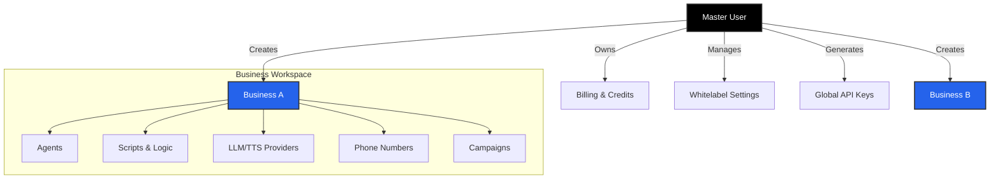

import { User, Building2, CreditCard, Users, Bot, GitFork, Phone } from 'lucide-react';

Iqra AI follows a hierarchical structure designed to support individual developers, agencies, and large enterprises simultaneously. Understanding this hierarchy is crucial for managing billing, permissions, and data isolation effectively.

## High-Level Hierarchy

At its core, the platform separates **Administration** (User) from **Operation** (Business).

## 1. The Master User
**The Administrator Level**

When you sign up for Iqra AI, you create a **User** account. This is the top-level entity responsible for the "financial" and "administrative" health of the account.

<Cards>
  <Card icon={<CreditCard />} title="Billing & Usage" href="/platform/billing">
    Manage your credit balance, payment methods, and view aggregated usage costs across all your businesses.
  </Card>
  <Card icon={<Users />} title="Whitelabeling" href="/platform/whitelabel">
    (SaaS Only) Configure custom domains, branding, and manage your own customers who access the platform under your brand.
  </Card>
  <Card icon={<Building2 />} title="Business Management" href="/platform/businesses">
    Create, delete, and manage multiple Businesses (Workspaces).
  </Card>
</Cards>

## 2. The Business (Workspace)
**The Operational Level**

A **Business** is an isolated container for your agents and data. You can think of it as a "Project" or "Workspace". All operational logic happens here.

<Callout type="idea" title="Isolation">
  Data does not leak between businesses. An Agent created in *Business A* cannot access the Phone Numbers or Scripts of *Business B*.
</Callout>

### Key Modules inside a Business:

<Cards>
  <Card icon={<Bot />} title="Agents" href="/build/agent">
    The "Persona". Defines the voice, personality, and interruption settings.
  </Card>
  <Card icon={<GitFork />} title="Scripts" href="/build/script">
    The "Logic". A graph-based flow that dictates how the conversation moves.
  </Card>
  <Card icon={<Phone />} title="Routing" href="/build/campaigns">
    Connects phone numbers to agents and defines inbound/outbound behaviors.
  </Card>
</Cards>

## 3. The Agency Model (Whitelabeling)

For Agencies, the hierarchy extends one step further. You can assign a **Business** to a **Customer**.

*   **You (The User):** Own the platform, set the prices, and manage the infrastructure.
*   **Your Customer:** Logs into a custom domain (e.g., `agent.your-agency.com`) and sees only the **Business Dashboard** assigned to them. They do not see your global billing or other businesses.

This architecture allows you to resell Iqra AI capabilities seamlessly while maintaining strict data boundaries.