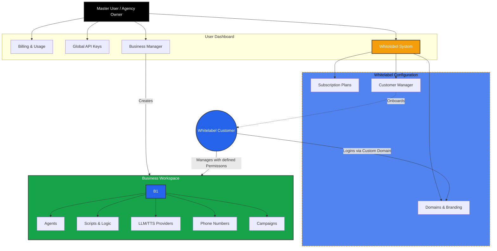

import { User, Building2, CreditCard, Users, Bot, GitFork, Phone, Database, Blocks, Network } from 'lucide-react';

Iqra AI follows a hierarchical structure designed to support individual developers, agencies, and large enterprises simultaneously.

The platform is divided into two distinct layers:
1.  **The Management Layer:** Handles Billing, Tenancy, and Whitelabeling (Cloud Only).
2.  **The Operational Layer:** Handles the actual AI Agents, Logic, and Routing (Open Source Core).

## Ecosystem Map

This diagram illustrates how the **Agency Owner** controls the platform and how **Customers** access their assigned workspaces.

## 1. The Master User
**The Administrator Level**

When you sign up for Iqra AI, you create a **User** account. This is the top-level entity responsible for the "financial" and "administrative" health of the account.

<Cards>
  <Card icon={<Building2 />} title="Business Management" href="/platform/businesses">
    Create, delete, and manage multiple **Workspaces**. Each business is an isolated container for your agents and data.
  </Card>
  
  <Card icon={<CreditCard />} title="Billing & Usage" href="/platform/billing">
    **(Cloud Only)** Manage your credit balance, payment methods, and view aggregated usage costs across all your businesses.
  </Card>
  
  <Card icon={<Users />} title="Whitelabeling" href="/platform/whitelabel">
    **(Cloud Only)** The Agency Engine. Configure custom domains, branding, subscription plans, and manage your own customers.
  </Card>
</Cards>

## 2. The Business (Workspace)
**The Operational Level**

A **Business** is where the work happens. It is a strictly isolated container for your AI logic. An Agent in *Workspace A* cannot access a Phone Number or Knowledge Base in *Workspace B*.

<Cards>
  <Card icon={<Bot />} title="Agents" href="/build/agent">
    **The Persona.** Define the voice, personality, interruption handling, and language settings.
  </Card>
  
  <Card icon={<GitFork />} title="Scripts & Logic" href="/build/script">
    **The Brain.** Use the Visual Builder to create conversation flows, **Action Flows**, and manage **Script Variables**.
  </Card>
  
  <Card icon={<Network />} title="Routing & Campaigns" href="/build/campaigns">
    **The Connection.** Connect Agents to the world via **Telephony** (Inbound/Outbound) or **Web** (Real-time Socket).
  </Card>
  
  <Card icon={<Blocks />} title="Tools & FlowApps" href="/build/tools">
    **The Capabilities.** Connect your agent to external systems (CRMs, Calendars) using our plugin system.
  </Card>
  
  <Card icon={<Database />} title="Data & Knowledge" href="/build/knowledge">
    **The Memory.** Manage RAG Knowledge Bases, Semantic Caching, and Business Context.
  </Card>
</Cards>

## 3. The Agency Model (Whitelabeling) *(Cloud Only Feature)*

For Agencies, the hierarchy extends one step further. You act as the **Platform Owner**.

1.  **You (The Agency):** Own the Iqra account, pay for usage, and set the pricing plans.
2.  **Your Customer:** Logs into *your* domain (e.g., `app.agency.com`). They only see the **Business Workspace** you have assigned to them.
3.  **Plan (Limits):** You can define a subscription plan for your customer to limit their use of features.
4.  **Permissions:** You can restrict what the customer sees (e.g., allow them to view Conversations but not edit Scripts).

<Callout type="info" title="Learn More">
  Deep dive into the Agency features in the [Whitelabeling Guide](/platform/whitelabel).
</Callout>