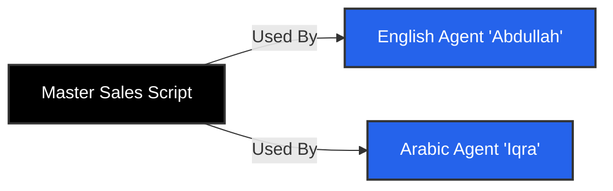

import { Bot, GitFork, Globe, Zap, Braces } from 'lucide-react';

To build effective Voice AI agents on Iqra AI, it is important to understand the design choices we have made. We prioritize **control** and **determinism** over "magic," giving you predictable results in production environments.

## Agents vs. Scripts
**Separating Personality from Logic**

In many platforms, an "Agent" is a single entity containing the prompt, the voice, and the tools. In Iqra AI, we decouple these into two distinct entities:

1.  **The Agent (The Persona):** Defines *who* is speaking. This includes the Voice (TTS), the Personality Prompt ("You are a helpful assistant"), the Configuration (Silence detection, Interruptions), and the Context (Knowledge Base).
2.  **The Script (The Logic):** Defines *what* happens. This is a graph-based flow that determines the conversation path, logic branches, and tool executions.



**Why this matters:** You can build complex logic *once* in a Script, and then attach it to multiple Agents with different languages, voices, or personalities without rebuilding the flow.

## Native Multi-Language
**Localization over Translation**

Iqra AI is a **Native Multi-Language** platform. We do not rely on real-time auto-translation layers, which often result in broken grammar, awkward pauses, or lost context.

When you build an Agent or a Script, you define content for specific languages (e.g., English and Arabic).
*   **Prompts:** You write a specific system prompt for English, and a specific system prompt for Arabic.
*   **Nodes:** In the Script Builder, every "AI Response" node requires text for every enabled language.

This ensures that your Arabic agent speaks natural, dialect-aware Arabic, while your English agent uses appropriate idioms, rather than both sounding like a machine translation.

<Callout type="info" title="Language Switching">
  Agents can switch languages dynamically during a call using the **Change Language** tool in the Script Builder.
</Callout>

## Latency & Regions
**Mastering the Speed of Light**

Voice AI is a race against time. A delay of more than 1 second feels unnatural. To achieve sub-500ms latency, physical distance matters.

Iqra AI allows you to select the **Processing Region** for your calls.

### The Latency Triangle
For the fastest response, you should align these three elements in the same geographical region:
1.  **The Carrier/Number:** Where the call originates (e.g., US Phone Number).
2.  **The Processing Server:** Where Iqra AI runs the logic (e.g., US East Server).
3.  **The Integrations:** Where your LLM and TTS providers are hosted (e.g., OpenAI US Servers).

If you buy a UK Phone Number but process the call in a US Server using an LLM hosted in Japan, the audio has to travel around the world three times for every single turn of conversation. Iqra AI gives you the controls to keep everything local.

## Templating (Scriban)
**Dynamic Variables**

To make your agents smart and dynamic, we use the **Scriban** templating engine. This allows you to inject variables from your CRM, the call metadata, or previous conversation steps into your Scripts and Prompts.

You will see the Templating Icon <Braces className="w-4 h-4 inline-block" /> in fields that support this feature.

**Example Usage:**
```liquid
Hello {{ customer.name }}, I see your appointment is on {{ date.to_string appointment_date "dd MMM yyyy" }}.
```

This powerful syntax allows for logic, loops, and formatting directly within your prompts.