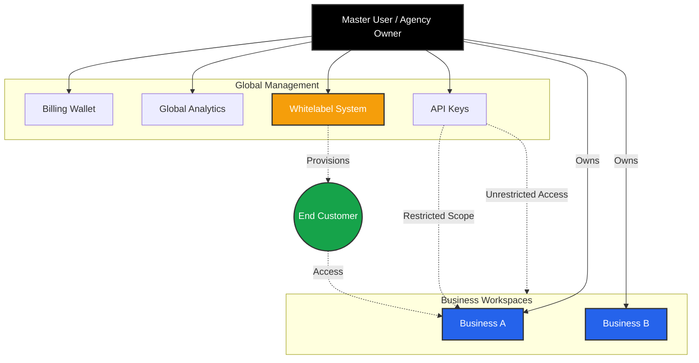

import { Building2, CreditCard, Key, Users, BarChart3 } from 'lucide-react';

The **User Dashboard** is the top-level management layer of Iqra AI. It is designed for the **Account Owner** or **Agency Administrator**.

Unlike the **[Business Dashboard](/build)** (which is for building agents), this dashboard focuses on **Governance**:
*   **Who** has access? (Tenancy & Whitelabeling)
*   **How much** are we spending? (Finance)
*   **How** is the system performing globally? (Analytics)

## Core Modules

<Cards>
  <Card icon={<Building2 />} title="Businesses" href="/platform/organization">
    **Workspaces.** Create isolated containers for your projects or clients. Each business has its own agents, numbers, and data.
  </Card>

  <Card icon={<CreditCard />} title="Billing & Plans" href="/platform/billing">
    **The Wallet.** Manage your credit balance, subscription plans, payment methods, and auto-refill settings.
  </Card>

  <Card icon={<BarChart3 />} title="Usage Analytics" href="/platform/usage">
    **The Ledger.** View aggregated cost reports, filter usage by business or feature, and audit transaction history.
  </Card>
  
  <Card icon={<Key />} title="API Keys" href="/platform/api-keys">
    **Access Control.** Generate secure tokens to control the platform programmatically. Support for Business-scoped keys.
  </Card>
  
  <Card icon={<Users />} title="Whitelabeling" href="/platform/whitelabel">
    **Agency Engine.** (Cloud Only) Rebrand the platform with your domain/logo and manage sub-customers.
  </Card>
</Cards>

## The Hierarchy Strategy

Iqra AI uses a strictly hierarchical model to ensure data safety, easy billing management, and agency scalability.

### Key Concepts

*   **Global Billing:** You pay for *all* usage across your businesses from a single wallet. You do not need separate credit cards for every workspace.
*   **Data Isolation:** While billing is shared, *data* is not. An API Key scoped to "Business A" cannot read the conversation logs of "Business B".
*   **Whitelabeling (Agency Mode):** As a Master User, you can create "Customers." A Customer is a sub-user who can log in to a specific Business Workspace via your custom domain (e.g., `app.youragency.com`), seeing only what you permit.

<Callout type="tip" title="Quick Navigation">
  To start building agents, click on any card in the **Businesses** tab to enter the Workspace context.
</Callout>