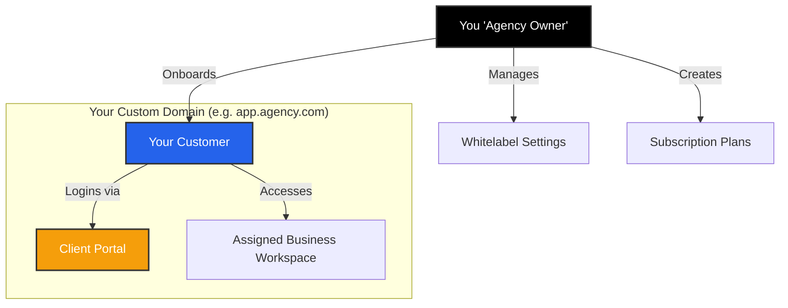

import { Users, Globe, Palette, CreditCard, TrendingUp } from 'lucide-react';

The **Whitelabeling System** transforms Iqra AI from a tool into a product you can sell. It allows Agencies and Enterprises to present the platform's capabilities to their own clients under a completely custom brand identity, domain, and pricing structure.

## The Agency Dashboard

When you enter the **Whitelabel Tab**, you are presented with an executive overview of your agency's health.

*   **MRR (Monthly Recurring Revenue):** Real-time tracking of revenue based on the Plans and Add-ons you have assigned to your customers.
*   **Customer Health:** Graphs showing Active, New, and Cancelled customers over time.
*   **Growth:** Date-filtered analytics to track your business expansion.

## The Reseller Hierarchy

It is important to understand how your customers interact with the platform compared to how you interact with it.

1.  **You (The Owner):** You have full access to the **User Dashboard**. You pay Iqra AI for usage.
2.  **Your Customer:** They only have access to the **Business Dashboard**. They pay *you* (offline/externally) based on the plans you define.
3.  **The Barrier:** Your customers **never** see Iqra AI branding, your billing details, or your other clients.

## Whitelabel Modules

To set up your agency, you will need to configure these four pillars:

<Cards>
  <Card icon={<Users />} title="Customers" href="/platform/whitelabel/customers">
    Manage your tenants. Create user accounts, assign them permissions, and link them to specific Business Workspaces.
  </Card>
  
  <Card icon={<CreditCard />} title="Plans & Pricing" href="/platform/whitelabel/plans">
    Define your economy. Create subscription tiers (e.g., "Gold Plan") with specific limits on minutes and concurrency.
  </Card>
  
  <Card icon={<Globe />} title="Domains & SSL" href="/platform/whitelabel/domains">
    Technical setup. Configure CNAME records to point your custom domain (e.g., `agent.yourcompany.com`) to our infrastructure.
  </Card>
  
  <Card icon={<Palette />} title="Branding" href="/platform/whitelabel/branding">
    Visual identity. Upload your logo, favicon, and inject custom CSS to completely overhaul the look and feel.
  </Card>
</Cards>